# Design Document: Agent Ops — Slack Integration

## Overview

The Slack integration for Agent Ops enables users to trigger headless LangGraph agent executions directly from Slack using the `/cloud-ops <task>` slash command. The system validates the incoming Slack request, creates a run record in DynamoDB, fires the agent asynchronously, and posts results back to the originating Slack channel via the `response_url` — all within Slack's 3-second acknowledgement window.

This feature extends the existing Nucleus Cloud Ops platform (Next.js on ECS Fargate) by adding a dedicated inbound trigger endpoint that bridges Slack's event model with the existing LangGraph agent infrastructure (`createDynamicExecutorGraph`). The data layer uses Dynamoose ODM against a single DynamoDB table (`AgentOpsTable`) that stores both run records and execution events.

The design covers the complete vertical slice: Slack signature verification → run creation → async agent execution → event streaming to DynamoDB → result delivery back to Slack.

---

## Architecture


---

## Sequence Diagrams

### Happy Path: Slash Command → Agent Execution → Result

```mermaid
sequenceDiagram
    participant U as Slack User
    participant S as /api/v1/trigger/slack
    participant V as slack-validator
    participant SVC as agent-ops-service
    participant DDB as DynamoDB
    participant EX as agent-executor
    participant LG as LangGraph (DynamicExecutorGraph)

    U->>S: POST /api/v1/trigger/slack (form-encoded)
    S->>V: verifySlackSignature(body, timestamp, sig)
    V-->>S: true / false
    alt invalid signature
        S-->>U: 401 Unauthorized
    end
    S->>S: parseSlackSlashCommand(body)
    S->>SVC: createRun({ tenantId, source:'slack', taskDescription, trigger })
    SVC->>DDB: PutItem (RUN record, status=queued)
    SVC-->>S: run { runId, threadId }
    S-->>U: 200 { response_type:'ephemeral', text:'🚀 Started, runId=...' }
    Note over S,EX: Fire-and-forget (no await)
    S->>EX: executeAgentRun(run)
    EX->>SVC: updateRunStatus(in_progress)
    EX->>LG: graph.streamEvents(input, { thread_id })
    loop For each LangGraph event
        LG-->>EX: event (on_chain_start, on_chat_model_end, on_tool_start, ...)
        EX->>SVC: recordEvent(runId, eventType, node, content)
        SVC->>DDB: PutItem (EVENT record)
    end
    LG-->>EX: stream complete
    EX->>SVC: updateRunStatus(completed, result)
    EX->>DDB: UpdateItem (durationMs)
    EX->>U: POST response_url { text: '✅ Complete\n<summary>' }
```



### Error Path: Agent Failure


---

## Components and Interfaces

### Component 1: Slack Trigger Route (`/api/v1/trigger/slack/route.ts`)

**Purpose**: Entry point for all Slack slash command invocations. Validates, parses, creates a run, and returns an immediate acknowledgement.

**Interface**:
```typescript
// Next.js App Router route handler
export async function POST(req: Request): Promise<NextResponse>

// Request: application/x-www-form-urlencoded (Slack slash command format)
// Headers required:
//   x-slack-request-timestamp: string  (Unix epoch seconds)
//   x-slack-signature: string          (v0=<hmac-sha256-hex>)

// Response (200 OK — immediate ack):
{
  response_type: 'ephemeral',
  text: '🚀 Agent Ops Started\nTask: ...\nRun ID: `<runId>`'
}

// Response (401 — bad signature):
{ error: 'Invalid signature' }
```

**Responsibilities**:
- Read raw body as text (required for HMAC verification — must not parse first)
- Delegate signature verification to `slack-validator.ts`
- Parse URL-encoded slash command payload
- Guard against empty `text` field with a helpful usage message
- Create run record via `agentOpsService.createRun()`
- Launch `executeAgentRun()` as fire-and-forget (no `await`)
- Attach `.then()` / `.catch()` handlers to post result/error back via `response_url`
- Return `200` within Slack's 3-second window

**Key constraint**: `export const maxDuration = 10` — Next.js serverless function timeout. The route itself returns fast; the agent runs in the same Node.js process asynchronously.

---

### Component 2: Slack Validator (`web-ui/lib/agent-ops/slack-validator.ts`)

**Purpose**: Cryptographic verification of Slack request authenticity.

**Interface**:
```typescript
export function verifySlackSignature(
    body: string,       // raw URL-encoded body (must not be pre-parsed)
    timestamp: string,  // x-slack-request-timestamp header value
    signature: string   // x-slack-signature header value (v0=<hex>)
): boolean

export function parseSlackSlashCommand(body: string): SlackSlashCommandPayload

export interface SlackSlashCommandPayload {
    token: string;
    team_id: string;
    team_domain: string;
    channel_id: string;
    channel_name: string;
    user_id: string;
    user_name: string;
    command: string;
    text: string;           // The task description after /cloud-ops
    response_url: string;   // Webhook URL for async result delivery
    trigger_id: string;
}
```

**Responsibilities**:
- Reject requests where `SLACK_SIGNING_SECRET` is not configured
- Reject requests older than 5 minutes (replay attack prevention)
- Compute `HMAC-SHA256(v0:<timestamp>:<body>, SLACK_SIGNING_SECRET)`
- Use `crypto.timingSafeEqual()` to prevent timing attacks
- Parse URL-encoded form body into typed `SlackSlashCommandPayload`

---

### Component 3: Agent Ops Service (`web-ui/lib/agent-ops/agent-ops-service.ts`)

**Purpose**: DynamoDB CRUD layer for run records and execution events via Dynamoose ODM.

**Interface**:
```typescript
export async function createRun(params: {
    tenantId: string;
    source: TriggerSource;
    taskDescription: string;
    mode: AgentMode;
    trigger: TriggerMetadata;
    accountId?: string;
    accountName?: string;
    selectedSkill?: string;
}): Promise<AgentOpsRun>

export async function updateRunStatus(
    tenantId: string,
    runId: string,
    status: AgentOpsStatus,
    extra?: { result?: AgentOpsResult; error?: string }
): Promise<void>

export async function getRun(tenantId: string, runId: string): Promise<AgentOpsRun | null>

export async function listRuns(query: RunListQuery): Promise<{
    runs: AgentOpsRun[];
    lastKey?: Record<string, unknown>;
}>

export async function recordEvent(params: {
    runId: string;
    eventType: AgentEventType;
    node: string;
    content?: string;
    toolName?: string;
    toolArgs?: Record<string, unknown>;
    toolOutput?: string;
    metadata?: Record<string, unknown>;
}): Promise<void>

export async function getRunEvents(runId: string): Promise<AgentOpsEvent[]>
```

**Responsibilities**:
- Generate `runId` (UUID v4) and `threadId` (`agent-ops-<runId>`) on `createRun`
- Set 30-day TTL on all records
- Use `process.hrtime()` nonce in event SK to guarantee uniqueness within the same millisecond
- Swallow event recording errors (never abort a run due to DynamoDB write failure)
- Support pagination via `lastKey` for run listing

---

### Component 4: Agent Executor (`web-ui/lib/agent-ops/agent-executor.ts`)

**Purpose**: Bridges trigger endpoints with the LangGraph agent. Manages isolated execution lifecycle and streams all events to DynamoDB.

**Interface**:
```typescript
export async function executeAgentRun(run: AgentOpsRun): Promise<void>
```

**Responsibilities**:
- Create isolated sandbox directory at `/tmp/agent-ops/<runId>/`
- Mark run `in_progress` before invoking the graph
- Build `GraphConfig` from run metadata (model, accounts, mcpServerIds)
- Invoke `createDynamicExecutorGraph(config)` from `executor-graphs.ts`
- Stream all LangGraph events via `graph.streamEvents(input, { version: 'v2', configurable: { thread_id } })`
- Map LangGraph event types to `AgentEventType` and persist via `recordEvent()`
- Capture final content from `on_chain_end` (node=`final`) or `on_chat_model_end`
- Track tools used, iteration count, token usage
- Mark run `completed` with result summary or `failed` with error message
- Always clean up sandbox directory in `finally` block

---

### Component 5: DynamoDB Models

#### AgentOpsRunModel (`web-ui/lib/agent-ops/models/agent-ops-run.ts`)

Single-table design. Stores one item per agent run.

```typescript
// Key structure
PK:     "TENANT#<teamId>"          // Slack team_id used as tenantId
SK:     "RUN#<runId>"
GSI1PK: "SOURCE#slack"
GSI1SK: "<ISO-timestamp>#<runId>"  // Enables time-sorted queries by source
```

#### AgentOpsEventModel (`web-ui/lib/agent-ops/models/agent-ops-event.ts`)

Stores one item per LangGraph streaming event.

```typescript
// Key structure
PK: "RUN#<runId>"
SK: "EVENT#<ISO-timestamp>#<hrtime-nanos>"  // Nonce ensures uniqueness
```

---

## Data Models

### AgentOpsRun

```typescript
interface AgentOpsRun {
    PK: string;                  // TENANT#<tenantId>
    SK: string;                  // RUN#<runId>
    GSI1PK: string;              // SOURCE#<source>
    GSI1SK: string;              // <timestamp>#<runId>
    runId: string;               // UUID v4
    tenantId: string;            // Slack team_id
    source: 'slack' | 'jira' | 'api';
    status: 'queued' | 'in_progress' | 'completed' | 'failed';
    taskDescription: string;     // Raw text from /cloud-ops <text>
    mode: 'plan' | 'fast';       // Determined by evaluator node at runtime
    threadId: string;            // agent-ops-<runId> — LangGraph isolation key
    trigger: SlackTriggerMeta;
    result?: {
        summary: string;
        toolsUsed: string[];
        iterations: number;
    };
    error?: string;
    createdAt: string;           // ISO 8601
    updatedAt: string;
    completedAt?: string;
    durationMs?: number;
    ttl: number;                 // Unix epoch + 30 days
}

interface SlackTriggerMeta {
    userId: string;              // Slack user_id
    userName?: string;
    channelId: string;
    channelName?: string;
    responseUrl: string;         // Slack webhook for async result posting
    teamId?: string;
}
```

### AgentOpsEvent

```typescript
interface AgentOpsEvent {
    PK: string;                  // RUN#<runId>
    SK: string;                  // EVENT#<ISO-ts>#<nanos>
    runId: string;
    eventType: 'planning' | 'execution' | 'tool_call' | 'tool_result'
             | 'reflection' | 'revision' | 'final' | 'error';
    node: string;                // LangGraph node: evaluator, planner, generate, tools, reflect, final
    content?: string;            // Capped at 10KB
    toolName?: string;
    toolArgs?: Record<string, unknown>;
    toolOutput?: string;         // Capped at 10KB
    metadata?: Record<string, unknown>;  // tokens, model, step, etc.
    createdAt: string;
    ttl: number;
}
```

---

## Key Functions with Formal Specifications

### `verifySlackSignature(body, timestamp, signature)`

**Preconditions:**
- `SLACK_SIGNING_SECRET` environment variable is set and non-empty
- `body` is the raw URL-encoded request body (not pre-parsed)
- `timestamp` is a string representation of a Unix epoch integer
- `signature` is in the format `v0=<64-char-hex>`

**Postconditions:**
- Returns `false` if `SLACK_SIGNING_SECRET` is missing
- Returns `false` if `|now - timestamp| > 300` seconds (replay protection)
- Returns `true` if and only if `HMAC-SHA256("v0:<timestamp>:<body>", secret)` matches `signature`
- Comparison uses `crypto.timingSafeEqual()` — constant-time, no timing oracle

**Loop Invariants:** N/A (no loops)

---

### `createRun(params)`

**Preconditions:**
- `params.tenantId` is non-empty (Slack `team_id`)
- `params.taskDescription` is non-empty (validated by route before calling)
- `params.trigger` contains valid `SlackTriggerMeta` with `responseUrl`

**Postconditions:**
- A new item exists in DynamoDB with `PK=TENANT#<tenantId>`, `SK=RUN#<runId>`
- `status = 'queued'`
- `threadId = 'agent-ops-<runId>'` (unique per run, prevents LangGraph state collision)
- `ttl = now + 30 days` (auto-expiry)
- Returns the full `AgentOpsRun` object

---

### `executeAgentRun(run)`

**Preconditions:**
- `run.runId` is a valid UUID
- `run.threadId` is unique across all concurrent runs
- `/tmp/agent-ops/` is writable

**Postconditions:**
- Run status transitions: `queued → in_progress → (completed | failed)`
- At least one event record exists in DynamoDB for the run
- Sandbox directory `/tmp/agent-ops/<runId>/` is deleted (even on failure)
- If completed: `run.result.summary` is non-empty
- If failed: `run.error` contains the error message

**Loop Invariants (event streaming loop):**
- Each iteration processes exactly one LangGraph event
- `toolsUsed` set grows monotonically (never shrinks)
- `iterationCount` increments only on `generate` or `agent` node starts
- Event recording failures do not abort the loop

---

## Algorithmic Pseudocode

### Slack Trigger Handler

```pascal
PROCEDURE handleSlackTrigger(request)
  INPUT: HTTP POST request from Slack
  OUTPUT: HTTP Response (< 3 seconds)

  BEGIN
    rawBody ← request.readText()
    timestamp ← request.header('x-slack-request-timestamp')
    signature ← request.header('x-slack-signature')

    IF NOT verifySlackSignature(rawBody, timestamp, signature) THEN
      RETURN Response(401, { error: 'Invalid signature' })
    END IF

    payload ← parseSlackSlashCommand(rawBody)
    taskDescription ← TRIM(payload.text)

    IF taskDescription = '' THEN
      RETURN Response(200, { response_type: 'ephemeral', text: 'Usage: /cloud-ops <task>' })
    END IF

    trigger ← SlackTriggerMeta {
      userId: payload.user_id,
      channelId: payload.channel_id,
      responseUrl: payload.response_url,
      teamId: payload.team_id
    }

    run ← agentOpsService.createRun({
      tenantId: payload.team_id,
      source: 'slack',
      taskDescription: taskDescription,
      mode: 'fast',
      trigger: trigger
    })

    // Fire-and-forget: do NOT await
    executeAgentRun(run)
      .then(() => postResultToSlack(run, payload.response_url))
      .catch((err) => postErrorToSlack(err, run.runId, payload.response_url))

    RETURN Response(200, {
      response_type: 'ephemeral',
      text: '🚀 Agent Ops Started\nRun ID: ' + run.runId
    })
  END
END PROCEDURE
```

### Agent Execution Lifecycle

```pascal
PROCEDURE executeAgentRun(run)
  INPUT: run of type AgentOpsRun
  OUTPUT: void (side effects: DynamoDB writes, Slack notification)

  BEGIN
    sandboxDir ← '/tmp/agent-ops/' + run.runId
    CREATE DIRECTORY sandboxDir

    TRY
      agentOpsService.updateRunStatus(run.tenantId, run.runId, 'in_progress')
      agentOpsService.recordEvent({ runId, eventType: 'planning', node: '__start__' })

      graphConfig ← buildGraphConfig(run)
      graph ← createDynamicExecutorGraph(graphConfig)

      graphInput ← { messages: [HumanMessage(run.taskDescription)] }
      graphRunConfig ← { configurable: { thread_id: run.threadId }, recursionLimit: 50 }

      toolsUsed ← empty Set
      iterationCount ← 0
      finalContent ← ''

      // Stream all LangGraph events
      FOR EACH event IN graph.streamEvents(graphInput, { version: 'v2', ...graphRunConfig }) DO
        ASSERT toolsUsed is monotonically growing
        result ← processLangGraphEvent(run.runId, event, toolsUsed)
        iterationCount ← iterationCount + (result.iterationDelta OR 0)
        IF result.finalContent ≠ '' THEN
          finalContent ← result.finalContent
        END IF
      END FOR

      agentOpsService.updateRunStatus(run.tenantId, run.runId, 'completed', {
        result: { summary: finalContent, toolsUsed: Array(toolsUsed), iterations: iterationCount }
      })

    CATCH error
      agentOpsService.updateRunStatus(run.tenantId, run.runId, 'failed', { error: error.message })
      agentOpsService.recordEvent({ runId, eventType: 'error', node: 'executor', content: error.message })

    FINALLY
      DELETE DIRECTORY sandboxDir (recursive, force)
    END TRY
  END
END PROCEDURE
```

### LangGraph Event Processor

```pascal
PROCEDURE processLangGraphEvent(runId, event, toolsUsed)
  INPUT: runId (string), event (LangGraph v2 event), toolsUsed (Set)
  OUTPUT: EventProcessingResult { iterationDelta, inputTokens, outputTokens, finalContent }

  BEGIN
    node ← event.metadata.langgraph_node OR event.name OR 'unknown'

    CASE event.event OF
      'on_chain_start':
        IF node IN ['evaluator', 'planner', 'generate', 'reflect', 'final', 'tools'] THEN
          recordEvent(runId, mapNodeToEventType(node), node, 'Node started')
          IF node IN ['generate', 'agent'] THEN iterationDelta ← 1 END IF
        END IF

      'on_chain_end':
        IF node = 'final' THEN
          finalContent ← extractLastMessageContent(event.data.output)
        END IF
        IF node = 'reflect' THEN
          recordEvent(runId, 'reflection', node, event.data.output.reflection)
        END IF
        IF node = 'planner' THEN
          recordEvent(runId, 'planning', node, formatPlan(event.data.output.plan))
        END IF

      'on_chat_model_end':
        usageMetadata ← event.data.output.usage_metadata
        inputTokens ← usageMetadata.input_tokens
        outputTokens ← usageMetadata.output_tokens
        FOR EACH toolCall IN event.data.output.tool_calls DO
          toolsUsed.add(toolCall.name)
          recordEvent(runId, 'tool_call', node, toolCall)
        END FOR
        IF event.data.output.content ≠ '' THEN
          recordEvent(runId, mapNodeToEventType(node), node, content)
        END IF

      'on_tool_start':
        toolsUsed.add(event.name)
        recordEvent(runId, 'tool_call', node, event.data.input)

      'on_tool_end':
        recordEvent(runId, 'tool_result', node, event.data.output)

      DEFAULT: // skip on_chat_model_stream, on_chain_stream (too noisy)
    END CASE

    RETURN { iterationDelta, inputTokens, outputTokens, finalContent }
  END
END PROCEDURE
```

---

## Error Handling

### Error Scenario 1: Invalid Slack Signature

**Condition**: `x-slack-signature` header doesn't match computed HMAC, or timestamp is stale (> 5 min old), or `SLACK_SIGNING_SECRET` is not set.
**Response**: `401 Unauthorized` with `{ error: 'Invalid signature' }`. Slack will show an error to the user.
**Recovery**: No run record is created. Operator must verify `SLACK_SIGNING_SECRET` env var matches the Slack app's signing secret.

### Error Scenario 2: Empty Task Description

**Condition**: User invokes `/cloud-ops` with no text.
**Response**: `200 OK` with ephemeral message: `⚠️ Please provide a task description. Example: /cloud-ops Check Lambda configurations`.
**Recovery**: User retries with a task description.

### Error Scenario 3: Agent Execution Failure

**Condition**: LangGraph graph throws during `streamEvents()` (e.g., Bedrock throttling, tool error, recursion limit).
**Response**: Run status set to `failed` with error message. Best-effort POST to `response_url` with `❌ Agent Ops failed: <msg>`.
**Recovery**: Run record persists in DynamoDB with error details. User can retry via a new slash command.

### Error Scenario 4: DynamoDB Write Failure (Event Recording)

**Condition**: `recordEvent()` throws (e.g., table not found, IAM permission issue).
**Response**: Error is logged but swallowed — the agent run continues uninterrupted.
**Recovery**: Run may complete with incomplete event history. Operator should check CloudWatch logs and DynamoDB table configuration.

### Error Scenario 5: Slack `response_url` POST Failure

**Condition**: The async result POST to Slack's `response_url` fails (network error, expired URL).
**Response**: Error is logged. Run record in DynamoDB still reflects `completed` status.
**Recovery**: User can check the Agent Ops dashboard UI to see the run result.

---

## Testing Strategy

### Unit Testing Approach

Key unit tests in `web-ui/tests/agent-ops/`:

- `slack-trigger.test.ts` — Signature validation (valid, invalid, stale timestamp, missing secret), payload parsing (all fields, empty text guard)
- `agent-ops-service.test.ts` — `createRun` creates correct DynamoDB keys, `recordEvent` swallows errors, `updateRunStatus` sets `completedAt` on terminal states

### Property-Based Testing Approach

**Property Test Library**: `fast-check` (already in the Next.js ecosystem)

Properties to verify:
- For any valid `(body, timestamp, secret)` triple: `verifySlackSignature` returns `true` if and only if the signature was computed with the same secret
- For any `runId`: event SK `EVENT#<ts>#<nanos>` is strictly unique across concurrent calls (nonce prevents collision)
- For any `taskDescription` string: `parseSlackSlashCommand` round-trips the `text` field without mutation

### Integration Testing Approach

Manual verification using `ngrok` to expose local Next.js to Slack:
```bash
ngrok http 3000
# Configure Slack app slash command URL to https://<ngrok-id>.ngrok.io/api/v1/trigger/slack
# Run: /cloud-ops Check Lambda configs in account 123456789
```

CDK diff to verify `AgentOpsTable` infrastructure:
```bash
cdk diff
```

---

## Performance Considerations

- **Slack 3-second window**: The route returns immediately after `createRun()`. The agent runs asynchronously in the same Node.js process. `createRun()` is a single DynamoDB `PutItem` — typically < 50ms on ECS Fargate in the same region.
- **Event write amplification**: Each LangGraph event generates one DynamoDB write. A typical run produces 20–100 events. `on_chat_model_stream` events are intentionally skipped to avoid write amplification.
- **Content size caps**: Event `content` and `toolOutput` are capped at 10KB per item to stay within DynamoDB's 400KB item limit.
- **Concurrent runs**: Each run gets a unique `threadId` and sandbox directory — no shared mutable state. ECS Fargate task memory (1–2GB) is the practical concurrency limit.
- **TTL**: All records expire after 30 days via DynamoDB TTL — no manual cleanup needed.

---

## Security Considerations

- **Replay attack prevention**: Requests with timestamps older than 5 minutes are rejected before any processing.
- **Timing-safe comparison**: `crypto.timingSafeEqual()` prevents timing oracle attacks on the HMAC comparison.
- **Secret not logged**: `SLACK_SIGNING_SECRET` is never logged or included in error responses.
- **Sandbox isolation**: Each run writes to `/tmp/agent-ops/<runId>/` — no cross-run file access.
- **AWS credentials**: The agent uses the ECS task role (IAM) — no credentials are stored in the run record or event records.
- **Input sanitization**: `taskDescription` is passed directly to the LLM as a `HumanMessage`. The LangGraph evaluator node determines safe execution mode (`plan` vs `fast` vs `end`).

---

## Dependencies

| Dependency | Purpose | Location |
|------------|---------|----------|
| `dynamoose` | DynamoDB ODM | `web-ui/node_modules` |
| `uuid` | Run ID generation | `web-ui/node_modules` |
| `@langchain/langgraph` | Agent graph execution | `web-ui/node_modules` |
| `@langchain/aws` | Bedrock LLM | `web-ui/node_modules` |
| `@langchain/core` | Message types | `web-ui/node_modules` |
| `crypto` (Node built-in) | HMAC-SHA256 for Slack verification | Node.js runtime |
| `SLACK_SIGNING_SECRET` | Env var — Slack app signing secret | `.env` / ECS task env |
| `AGENT_OPS_TABLE_NAME` | Env var — DynamoDB table name | `.env` / ECS task env |
| `AgentOpsTable` (CDK) | DynamoDB table with GSI1 + TTL | `lib/computeStack.ts` |
