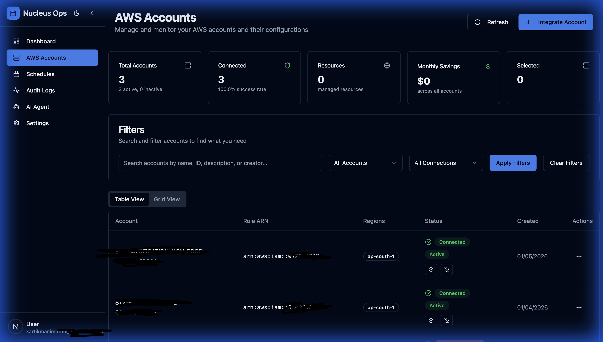

# Nucleus Cloud Ops

<p align="center">
  
</p>

<p align="center">
  <strong>Enterprise-grade AWS Cloud Operations Platform with AI Ops & GenAI DevOps Agent built on AWS Bedrock for Multi-Account Management.</strong>
</p>

<p align="center">
  <a href="#features">Features</a> •
  <a href="#quick-start">Quick Start</a> •
  <a href="#documentation">Documentation</a> •
  <a href="#architecture">Architecture</a> •
  <a href="#contributing">Contributing</a>
</p>

---

## 🎯 What is Nucleus Cloud Ops?

Nucleus Cloud Ops is a centralized platform for automating AWS resource management across multiple accounts. It leverages **AI Ops** and **GenAI** to optimize cloud operations and reduce costs.

### The Problem

- **Idle Resources**: Development and staging environments run 24/7 but are only used during business hours
- **Manual Management**: DevOps teams spend hours manually managing resource states
- **Multi-Account Complexity**: Enterprises struggle to coordinate schedules across dozens of AWS accounts
- **Lack of Visibility**: No centralized view of scheduling operations and cost savings


### The Solution

Nucleus Ops provides:

- 🕐 **Automated Scheduling**: Start/stop EC2, RDS, and ECS resources on custom schedules
- 🌐 **Multi-Account Support**: Manage N accounts from a single pane of glass
- 🤖 **AI-Powered Agent**: Natural language interface for cloud operations
- 📊 **Comprehensive Auditing**: Full visibility into all actions and executions
- 💰 **Cost Tracking**: Real-time savings estimation and reporting

---

## ✨ Features

### 📊 Cost Optimization Dashboard
Real-time overview of schedules, accounts, savings, and recent activity.

### 🔗 AWS Account Integration
Seamlessly connect multiple AWS accounts using secure cross-account IAM roles.



### ⏰ Intelligent Scheduling
Create flexible schedules with:
- Customizable time windows
- Weekday/weekend configurations
- Timezone support
- Multi-resource selection (EC2, RDS, ECS)

### 📝 Audit Trail
Complete audit logging with:
- User and system action tracking
- 30-day retention
- Advanced filtering and search
- Export capabilities


### 🤖 AI DevOps Agent
Natural language cloud management powered by Claude 4.5 Sonnet:
- Cost analysis and reporting
- Security audits
- Troubleshooting assistance
- Automated documentation


### 🎨 Customizable UI
Dark/light themes, multiple color schemes, and typography options.


---

## 🚀 Quick Start

### Prerequisites

- Node.js 22+
- AWS CLI configured
- AWS CDK installed (`npm install -g aws-cdk`)
- Access to an AWS account with admin permissions

### Installation

```bash
# Clone the repository
git clone https://github.com/kartikmanimuthu/nucleus-cloud-ops.git
cd nucleus-cloud-ops

# Install dependencies
npm install
cd web-ui && npm install && cd ..

# Configure environment
cp web-ui/.env.local.example web-ui/.env.local
# Edit .env.local with your settings

# Deploy infrastructure
npx cdk deploy --all

# Or run locally
cd web-ui
npm run dev
```

### Environment Variables

```bash
# Required
AWS_REGION=ap-south-1
DYNAMODB_TABLE_NAME=nucleus-ops-main
DYNAMODB_AUDIT_TABLE_NAME=nucleus-ops-audit
NEXTAUTH_SECRET=your-secret-here

# Optional (for AI Agent)
DYNAMODB_CHECKPOINT_TABLE=nucleus-ops-checkpoints
DYNAMODB_WRITES_TABLE=nucleus-ops-writes
TAVILY_API_KEY=your-tavily-key
```

---

## 📚 Documentation

| Document | Description |
|----------|-------------|
| [Architecture Guide](docs/ARCHITECTURE.md) | Technical architecture, diagrams, and data models |
| [Features Guide](docs/FEATURES.md) | Comprehensive feature documentation with screenshots |
| [Product Requirements](docs/product-requirement-document.md) | Original PRD |
| [Technical Review](docs/technical-review-document.md) | Technical decisions and rationale |
| [Schema Design](docs/schema-design.md) | DynamoDB table design |

---

## 🏗️ Architecture

```
┌─────────────────────────────────────────────────────────────┐
│                     Nucleus Cloud Ops Platform                     │
├─────────────────────────────────────────────────────────────┤
│  ┌──────────────┐  ┌──────────────┐  ┌──────────────────┐  │
│  │   Next.js    │  │   LangGraph  │  │  Lambda Scheduler │  │
│  │   Web UI     │  │   AI Agent   │  │   (EventBridge)   │  │
│  └──────────────┘  └──────────────┘  └──────────────────┘  │
│           │                │                    │           │
│           └────────────────┼────────────────────┘           │
│                            │                                 │
│                   ┌────────▼────────┐                       │
│                   │    DynamoDB     │                       │
│                   │  (Single Table) │                       │
│                   └─────────────────┘                       │
└─────────────────────────────────────────────────────────────┘
                             │
                    ┌────────▼────────┐
                    │   AWS STS       │
                    │  AssumeRole     │
                    └────────┬────────┘
                             │
        ┌────────────────────┼────────────────────┐
        │                    │                    │
┌───────▼───────┐   ┌────────▼────────┐  ┌───────▼───────┐
│  AWS Account  │   │   AWS Account   │  │  AWS Account  │
│      A        │   │       B         │  │      C        │
│  (EC2, RDS)   │   │   (ECS, RDS)    │  │     (EC2)     │
└───────────────┘   └─────────────────┘  └───────────────┘
```

### Technology Stack

| Layer | Technologies |
|-------|--------------|
| **Frontend** | Next.js 15, React 19, Tailwind CSS, Radix UI |
| **Backend** | Node.js, AWS SDK v3, LangGraph, LangChain |
| **AI** | AWS Bedrock (Claude 4.5 Sonnet) |
| **Database** | Amazon DynamoDB (Single Table Design) |
| **Infrastructure** | AWS CDK, Lambda, ECS Fargate, CloudFront |
| **Auth** | NextAuth.js, AWS Cognito |

---

## 📂 Project Structure

```
nucleus-cloud-ops/
├── bin/                    # CDK app entry point
├── lib/                    # CDK stack definitions
│   ├── cdkStack.ts         # Main stack
│   ├── computeStack.ts     # ECS, ALB, CloudFront
│   ├── networkingStack.ts  # VPC, Subnets
│   └── webUIStack.ts       # Web UI deployment
├── lambda/                 # Lambda functions
│   └── scheduler/          # Scheduler execution logic
├── web-ui/                 # Next.js application
│   ├── app/                # App router pages
│   ├── components/         # React components
│   ├── lib/                # Utilities and services
│   │   └── agent/          # AI agent implementation
│   └── styles/             # CSS styles
├── docs/                   # Documentation
│   ├── ARCHITECTURE.md     # Technical architecture
│   ├── FEATURES.md         # Feature guide
│   └── screenshots/        # UI screenshots
└── test/                   # Test files
```

---

## 🔐 Security

- **Cross-Account Access**: Uses temporary credentials via `sts:AssumeRole`
- **Least Privilege**: Minimal IAM permissions for target accounts
- **Encryption**: DynamoDB encryption at rest (KMS)
- **Authentication**: NextAuth.js with Cognito integration
- **Audit Logging**: All actions recorded with 30-day retention

---

## 🛠️ Development

### Running Locally

```bash
cd web-ui

# With AWS profile
AWS_PROFILE=your-profile npm run dev

# Access at http://localhost:3000
```

### Deploying

```bash
# Deploy all stacks
npx cdk deploy --all --profile your-profile

# Deploy specific stack
npx cdk deploy WebUIStack --profile your-profile
```

### Testing

```bash
# Run tests
npm test

# Lint
cd web-ui && npm run lint
```

---

## 🤝 Contributing

Contributions are welcome! Please read our contributing guidelines before submitting PRs.

1. Fork the repository
2. Create a feature branch (`git checkout -b feature/amazing-feature`)
3. Commit changes (`git commit -m 'Add amazing feature'`)
4. Push to branch (`git push origin feature/amazing-feature`)
5. Open a Pull Request

---

## 📄 License

This project is licensed under the MIT License - see the [LICENSE](LICENSE) file for details.

---

## 🙏 Acknowledgments

- [AWS CDK](https://aws.amazon.com/cdk/) - Infrastructure as Code
- [LangGraph](https://github.com/langchain-ai/langgraph) - AI Agent Framework
- [Radix UI](https://www.radix-ui.com/) - Accessible UI Components
- [Tailwind CSS](https://tailwindcss.com/) - Utility-first CSS

---

<p align="center">Built with ❤️ for the cloud community</p>
