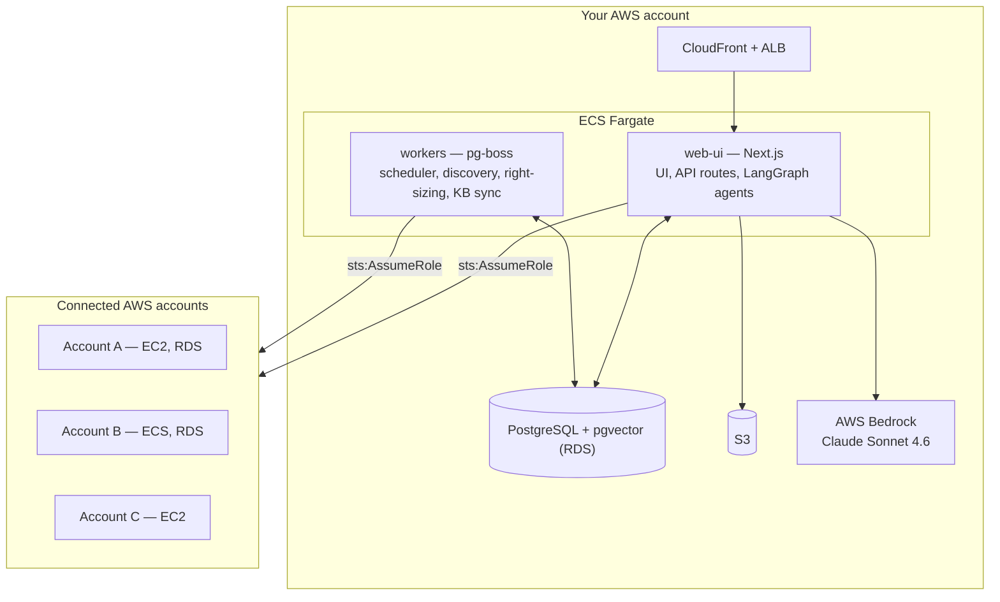

<div align="center">

# Nucleus Ops

**Open-source, self-hostable AI Ops agent for AWS.**

Schedule idle resources across every account, discover your whole footprint, and run cloud operations in plain English — on infrastructure you own.

[](LICENSE)
[](https://github.com/kartikmanimuthu/nucleus-cloud-ops/stargazers)
[](CONTRIBUTING.md)
[](https://nextjs.org/)
[](https://www.pulumi.com/)
[](https://www.postgresql.org/)

[Quick Start](#-quick-start) · [Features](#-features) · [How it works](#%EF%B8%8F-how-it-works) · [Docs](#-documentation) · [Comparison](#-how-it-compares) · [Contributing](CONTRIBUTING.md)


</div>

---

## What is Nucleus Ops?

Nucleus Ops is a multi-tenant AWS cloud operations platform you run yourself. It combines three things most teams cobble together separately:

1. **A cost scheduler** that starts and stops non-production EC2, RDS, and ECS resources on a schedule across every connected account.
2. **An inventory + right-sizing engine** that continuously discovers what you actually have running.
3. **An AI Ops agent** (LangGraph + AWS Bedrock) that can investigate, explain, and act on your infrastructure through natural language — with approval gates and a full audit trail.

Your AWS credentials never leave your environment. Cross-account access is exclusively via `sts:AssumeRole` — no long-lived keys are stored anywhere in the system.

### Why it exists

- Non-production environments run 24/7 but are used ~50 hours a week. Shutting them off outside business hours removes roughly **70% of their compute cost**.
- Once you pass a handful of AWS accounts, "what is running, and who changed it" stops being answerable from the console.
- Cloud-ops SaaS tools want cross-account access to your entire estate. For a lot of teams that is a non-starter — so this is self-hosted by design.

---

## ✨ Features

| | |
|---|---|
| ⏰ **Cost Scheduler** | Start/stop EC2, RDS, and ECS on cron schedules with timezone and weekday/weekend windows. |
| 🌐 **Multi-Account** | Manage many AWS accounts from one pane of glass via cross-account IAM roles. |
| 🤖 **AI Ops Agent** | Natural-language cloud operations on AWS Bedrock (Claude Sonnet 4.6). Plan → Execute → Reflect → Revise, with per-tool approval gates. |
| ⚡ **Agent Ops** | Scheduled and event-triggered autonomous agent runs (cron, Slack, Jira, API) with full run history. |
| 🔍 **Inventory Discovery** | Background scans across accounts and regions; filter, export, and ask questions about your footprint. |
| 📉 **Right-Sizing** | CloudWatch-driven EC2/RDS/EBS/ASG recommendations with live pricing data. |
| 📚 **Knowledge Base** | pgvector-backed RAG over S3, Bitbucket, Confluence, and inline docs. |
| 🔗 **Channels** | Slack slash commands, Jira automation triggers, Telegram, and MCP servers. |
| 🔐 **RBAC + Multi-Tenancy** | CASL-based per-module roles; every query is tenant-scoped at the ORM layer. |
| 📝 **Audit Trail** | Immutable log of every action, with filtering and CSV export. |
| 🔑 **Certificate Manager** | ACM certificate inventory, expiry monitoring, and cross-account deployment. |
| 🧠 **Agent Memory & Skills** | Semantic, episodic, and procedural memory; reusable, human-approved skills. |

> Screenshots for each module live in [`docs/screenshots/`](docs/screenshots/) and the [Features guide](docs/FEATURES.md).

---

## 🚀 Quick Start

**Prerequisites:** Node.js 20+, [Bun](https://bun.sh), Docker (for local Postgres), and an AWS profile with access to Bedrock.

```bash
# 1. Clone
git clone https://github.com/kartikmanimuthu/nucleus-cloud-ops.git
cd nucleus-cloud-ops

# 2. Install (single Bun workspace — hoists to all apps)
bun install

# 3. Configure — one root .env is shared by both apps
cp .env.example .env
#    Required: DATABASE_URL, AWS_REGION, NEXTAUTH_SECRET,
#              COGNITO_USER_POOL_ID, COGNITO_APP_CLIENT_ID, COGNITO_APP_CLIENT_SECRET

# 4. Start Postgres (pgvector) and apply migrations
docker compose up -d postgres
cd apps/web-ui && bun run db:migrate && cd ../..

# 5. Run
bun run dev            # web UI on http://localhost:3001
bun run dev:workers    # background job workers (separate terminal)
```

Then open <http://localhost:3001>, connect your first AWS account, and create a schedule.

### Common commands

```bash
bun run dev            # web-ui (Next.js, port 3001)
bun run dev:workers    # pg-boss workers
bun run build          # build all projects via Nx
bun run test           # run all test suites
bun run lint           # lint all projects
bun run e2e            # Playwright end-to-end suite
bun run graph          # visualise the Nx task graph
```

---

## 🏗️ How it works



Two services, one database. The Next.js app serves the UI, the REST API, and runs the LangGraph agents in-process; the workers service runs every scheduled and background job through pg-boss. All state lives in PostgreSQL (via Prisma) or S3 — there are **no Lambda functions and no DynamoDB**.

### Stack

| Layer | Technology |
|---|---|
| **Frontend** | Next.js 15, React 19, Tailwind CSS, Radix UI, TanStack Query, React Hook Form + Zod |
| **AI Agent** | LangGraph, LangChain, AWS Bedrock (Claude Sonnet 4.6), MCP |
| **Backend** | Node.js 20, AWS SDK v3, NextAuth.js + Cognito, CASL RBAC |
| **Database** | PostgreSQL with pgvector, Prisma ORM (repository pattern) |
| **Background jobs** | pg-boss workers on ECS Fargate |
| **Infrastructure** | Pulumi (`infra/networking` → `infra/compute`), ECS Fargate, RDS, CloudFront |
| **Monorepo** | Nx 21 + Bun workspaces |
| **Testing** | Vitest, Jest, Playwright, fast-check |

---

## 📂 Repository layout

```
nucleus-cloud-ops/
├── apps/
│   ├── web-ui/        # Next.js App Router — pages, API routes, agents, services
│   ├── workers/       # pg-boss background jobs (scheduler, discovery, right-sizing, kb-sync)
│   └── web-ui-e2e/    # Playwright end-to-end tests
├── libs/
│   └── prisma/        # Prisma schema + migrations (shared by both apps)
├── infra/
│   ├── networking/    # Pulumi: VPC, subnets
│   ├── compute/       # Pulumi: ECS, RDS, Cognito, CloudFront
│   └── cicd/          # CodeBuild specs
└── docs/              # Architecture, features, PRDs, screenshots
```

---

## ☁️ Deploying to AWS

Infrastructure is managed entirely by [Pulumi](https://www.pulumi.com/). Always deploy networking before compute.

```bash
cd infra/networking && npm install && pulumi install
cd ../compute      && npm install && pulumi install

# Preview first
cd infra/compute && AWS_PROFILE=your-profile pulumi preview --stack prod

# Deploy — networking, then compute
cd ../networking && AWS_PROFILE=your-profile pulumi up --stack prod --yes
cd ../compute    && AWS_PROFILE=your-profile pulumi up --stack prod --yes
```

`pulumi up` detects source changes, builds and pushes the `web-ui` and `workers` Docker images, and rolls out new ECS task definitions automatically. Full guide: [`infra/DEPLOYMENT.md`](infra/DEPLOYMENT.md).

---

## 🔐 Security

- **No stored credentials.** All cross-account access uses temporary credentials from `sts:AssumeRole`.
- **Least privilege.** Target accounts grant a scoped IAM role; the CloudFormation template for it is generated in-app.
- **Tenant isolation.** Every query goes through `getTenantClient(tenantId)`, which enforces `tenant_id` scoping at the Prisma layer.
- **RBAC.** Module-scoped roles via CASL, checked on every mutating API route.
- **Audit logging.** Every action that touches an AWS resource is recorded immutably.
- **Approval gates.** The AI agent asks before running mutating operations unless you explicitly enable auto-approve.

Found a vulnerability? Please follow [SECURITY.md](SECURITY.md) — do not open a public issue.

---

## 🔍 How it compares

| | Nucleus Ops | AWS Instance Scheduler | Cloud Custodian | Komiser |
|---|---|---|---|---|
| Self-hosted | ✅ | ✅ | ✅ | ✅ |
| Resource scheduling | ✅ | ✅ | ✅ (policy-driven) | ❌ |
| Multi-account inventory | ✅ | ❌ | ⚠️ via policies | ✅ |
| Right-sizing recommendations | ✅ | ❌ | ❌ | ⚠️ basic |
| AI agent / natural-language ops | ✅ | ❌ | ❌ | ❌ |
| Web UI with RBAC | ✅ | ❌ (config files) | ❌ (YAML/CLI) | ✅ |
| Slack / Jira integration | ✅ | ❌ | ⚠️ via hooks | ❌ |
| Audit trail | ✅ | ⚠️ CloudWatch | ⚠️ logs | ❌ |

Cloud Custodian is an excellent policy engine and Komiser is strong at visibility — Nucleus Ops targets the operational layer above both: a UI, an agent, approvals, and an audit trail for a team, not just a CLI for an engineer.

---

## 📚 Documentation

| Document | Description |
|---|---|
| [Architecture](docs/ARCHITECTURE.md) | System design, data flow, and component boundaries |
| [AI Ops Architecture](docs/AI_OPS_ARCHITECTURE.md) | Agent graphs, tools, memory, and skills |
| [Features](docs/FEATURES.md) | Full feature walkthrough with screenshots |
| [Deployment](infra/DEPLOYMENT.md) | Production deployment via Pulumi |
| [Agent memory](docs/agent-memory-architecture.md) | Semantic, episodic, and procedural memory design |
| [Right-sizing](docs/RIGHT_SIZING_ARCHITECTURE.md) | Recommendation engine and pricing data |
| [Data model](libs/prisma/schema.prisma) | Prisma schema — the single source of truth for all models |
| [Tech stack](docs/techstack.md) | Dependency-level breakdown |

The app also serves its own documentation site at `/docs` when running.

---

## 🤝 Contributing

Contributions are very welcome — see [CONTRIBUTING.md](CONTRIBUTING.md) for the development workflow, coding conventions, and commit style. Good places to start:

- Browse [open issues](https://github.com/kartikmanimuthu/nucleus-cloud-ops/issues)
- Improve documentation (docs live in `docs/` and `apps/web-ui/content/docs/`)
- Add support for another AWS resource type in the scheduler or discovery scan

Please also read our [Code of Conduct](CODE_OF_CONDUCT.md).

---

## 📄 License

MIT — see [LICENSE](LICENSE). Free to self-host, fork, and modify.

---

<div align="center">

Built for teams who want cloud automation without handing over the keys.

⭐ Star the repo if this is useful to you.

</div>
