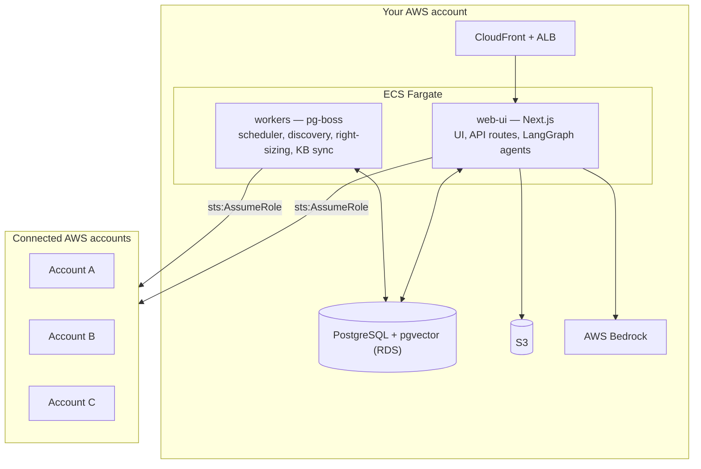

Nucleus Ops runs as **two services against one PostgreSQL database**. There is no separate agent service, no message broker, and no serverless layer to reason about.

## The two services

### `web-ui`

A Next.js App Router application that serves three things from one container:

- **Pages** under `app/app/` — the dashboard, inventory, schedules, agent workspace, and settings
- **REST API** under `app/api/` — every route authorises with CASL RBAC and reads through the repository layer
- **AI agents** — LangGraph state machines that run *in-process*, so a chat request and its tool calls share one runtime

### `workers`

A single Node process running [pg-boss](https://github.com/timgit/pg-boss) jobs. Because pg-boss uses PostgreSQL itself as the queue, there is no separate broker to operate. Jobs include:

| Job | What it does |
|---|---|
| `scheduler` | Evaluates schedules and starts/stops resources across accounts |
| `discovery` | Multi-account, multi-region resource scans via the AWS SDK |
| `right-sizing` | CloudWatch-driven recommendations plus a weekly pricing refresh |
| `kb-sync` | Ingests and embeds knowledge-base sources (S3, Bitbucket, Confluence) |
| `agent-ops-scheduler` | Fires scheduled autonomous agent runs |
| `certificate-expiry-monitor` | Flags ACM certificates nearing expiry |

## Where state lives

Everything persistent is in PostgreSQL or S3.

| Data | Storage |
|---|---|
| Accounts, schedules, RBAC, tenants | PostgreSQL via Prisma repositories |
| Inventory and right-sizing results | PostgreSQL |
| Audit log | PostgreSQL (immutable, with retention) |
| Agent chat history | PostgreSQL (`agent_chat_history`) |
| LangGraph thread checkpoints | PostgreSQL, with S3 offload for large checkpoints |
| Long-term agent memory + KB chunks | PostgreSQL with pgvector (HNSW index) |

## The agent layer

Three agent types share a common toolset and are constructed through `graph-factory.ts`:

- **Fast agent** — a textbook ReAct loop for direct questions
- **Planning agent** — planner → executor → reflector → reviser for multi-step work
- **Deep agent** — extended thinking for long-running investigations

On top of the graphs sit the cognitive features: semantic memory (recall/remember), episodic memory (past runs replayed as few-shot experience), procedural memory (operating rules learned from corrections), and Skills — reusable, human-approved playbooks.

A chat turn is routed by a triage step that decides between answering directly and running a full graph, and can auto-select a relevant Skill.

## Cross-account access

Nucleus Ops never stores AWS credentials for the accounts it manages. When it needs to act on a connected account it calls `sts:AssumeRole` against a role that account has granted, and uses the resulting temporary credentials for that operation only.

You create that role from a CloudFormation template generated in the app under **AWS Accounts → Integrate Account**. Scope it to the permissions you actually want Nucleus Ops to have — read-only if you only want inventory and recommendations.

## Multi-tenancy

Every tenant's data lives in the same tables, separated by `tenant_id`. Isolation is enforced in the data layer rather than by convention: application code obtains a client via `getTenantClient(tenantId)`, a Prisma extension that injects the tenant filter into every query.

<Callout type="warn">
`$executeRaw` is **not** intercepted by the tenant extension. Any raw SQL must scope
`tenant_id` manually. This is the one place where tenant isolation depends on the author
rather than the framework.
</Callout>

## Deployment topology

Two Pulumi stacks, deployed in order:

1. **`infra/networking`** — VPC, public and private subnets, subnet groups
2. **`infra/compute`** — ECS Fargate cluster running both services, RDS PostgreSQL, Cognito, S3, and CloudFront

See [Installation](/docs/installation) for the deploy commands.

<Callout>
There are **no AWS Lambda functions** in this project. Everything that was once a Lambda —
scheduling, discovery, knowledge-base sync — is now a pg-boss job in the `workers` service.
Likewise, DynamoDB has been fully replaced by PostgreSQL.
</Callout>
