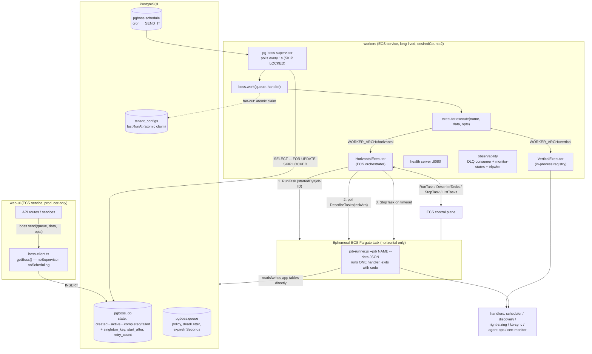
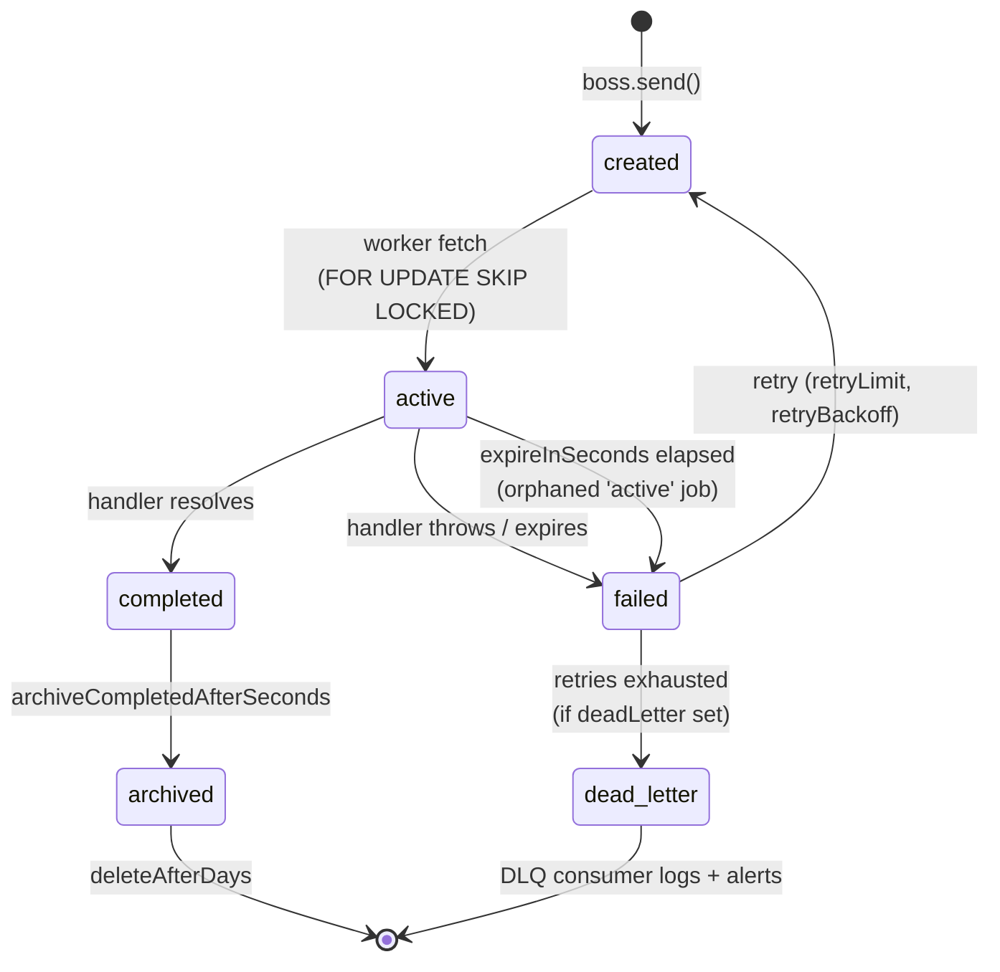
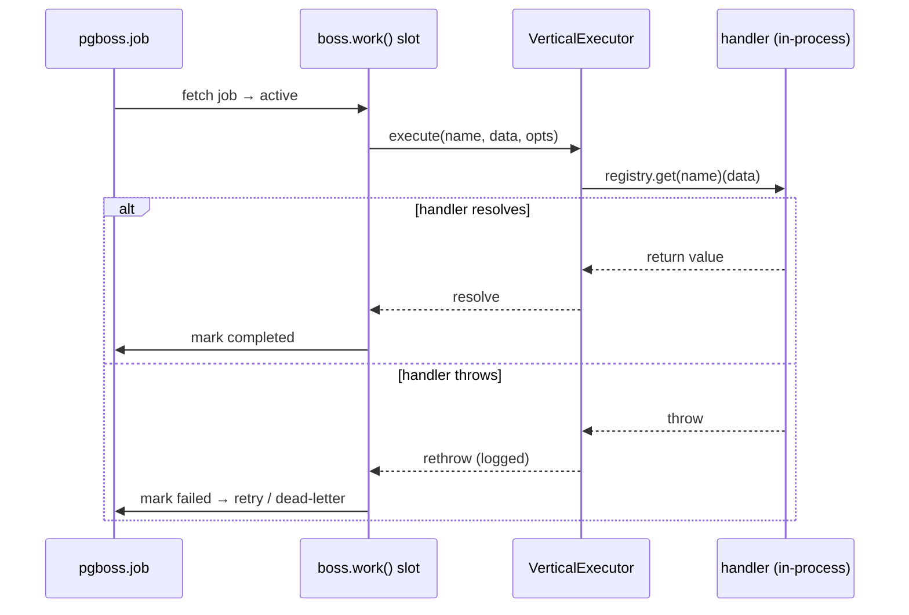
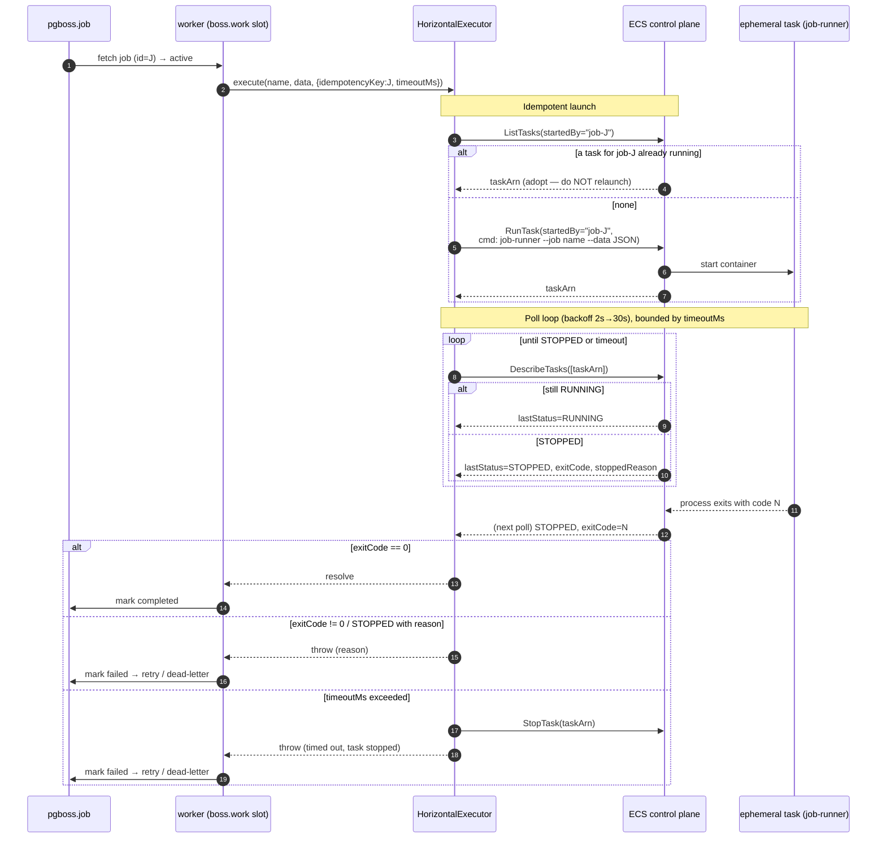
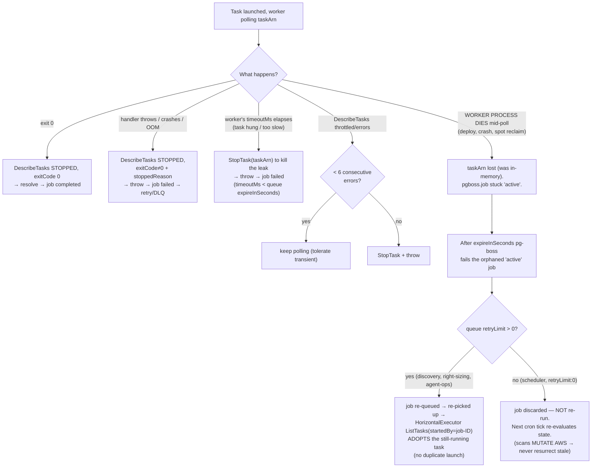
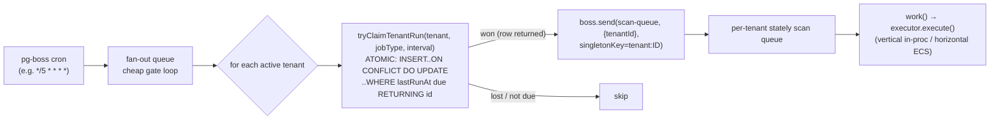

# pg-boss Worker Architecture — Vertical & Horizontal Execution

> Authoritative, current (post-reliability-hardening) description of how the
> workers service processes background jobs on top of pg-boss, in both `vertical`
> and `horizontal` modes. Focuses on the part that is easy to get wrong: **how a
> horizontally-dispatched ephemeral task's success/failure gets back to the worker,
> and how the worker keeps track of that task.**
>
> Companion to [`../ARCHITECTURE.md`](../ARCHITECTURE.md) (which has the directory
> layout and IAM detail).

---

## 1. The mental model in one paragraph

Everything is mediated by **PostgreSQL**, not by direct connections between
processes. The web-ui (producer) writes a row into `pgboss.job`. The workers
service (consumer) polls that table, claims a row, and runs a **handler**. In
`vertical` mode the handler runs *in the worker process*. In `horizontal` mode the
handler runs in a *separate ephemeral ECS Fargate task*, and the worker process
becomes an **orchestrator** that launches the task and watches it via the ECS
control plane. There is **no socket, no callback, and no message** from the
ephemeral task back to the worker — the only things that cross the boundary are the
task's **process exit code** (read by polling `DescribeTasks`) and a **`startedBy`
tag** that ties the ECS task to the pg-boss job id so the two can be re-linked after
a crash.

---

## 2. Component overview



Key point: the **ephemeral task does not talk to pg-boss at all**. `job-runner.ts`
imports the handler functions directly and runs exactly one, then exits. All queue
bookkeeping (marking the job completed/failed, retries, dead-lettering) stays in the
long-lived worker process. The ephemeral task is deliberately "dumb."

---

## 3. The pg-boss job lifecycle (shared by both modes)

pg-boss is a Postgres-backed queue. There is **no LISTEN/NOTIFY push** — consumers
poll (`pollingIntervalSeconds: 1` here, see [`boss.ts`](../src/boss.ts)).



- **`SELECT ... FOR UPDATE SKIP LOCKED`** is why running **multiple worker replicas
  is safe**: two replicas polling the same queue never grab the same row.
- **Queue policy `stately`** = at most one job in `created` *and* one in `active`
  per `singletonKey`. This is how a cron that keeps firing can't stack a backlog,
  and how per-tenant de-dup works (`singletonKey: tenant:<id>`).
- **`expireInSeconds`** bounds how long an orphaned `active` job (its worker died
  mid-run) lingers before pg-boss fails it. It also caps handler runtime.
- **`deadLetter`** routes exhausted/expired jobs to the shared `dead-letter` queue,
  whose consumer logs a high-severity line + emits a CloudWatch metric.

---

## 4. Vertical mode

The handler runs **inside the worker process**. Simple, synchronous from pg-boss's
point of view, and the handler's **return value is available in-process**.



- Success = the handler promise resolves → pg-boss marks the job `completed`.
- Failure = the handler throws → pg-boss marks it `failed` → retry per `retryLimit`,
  then dead-letter.
- Concurrency is bounded by the worker's own CPU/memory and the queue's `batchSize`.
- This is the default (`WORKER_ARCH=vertical`) and what the local dev runner uses.

---

## 5. Horizontal mode — the part you asked about

The handler runs in a **separate ephemeral Fargate task**. The worker's `work()`
slot does **not** run business logic; it runs `HorizontalExecutor.run()`, which
**launches the task and then blocks, polling ECS, until the task stops.**



### 5.1 How success/error is populated back to the worker

**There is no return channel from the task to the worker.** The connection is the
**ECS control plane, polled**. Concretely, in
[`executor/horizontal.ts`](../src/executor/horizontal.ts):

1. `RunTaskCommand` returns a **`taskArn`** — the worker's handle on the task.
2. The worker enters a **poll loop** calling `DescribeTasksCommand({tasks:[taskArn]})`
   with exponential backoff (2s → capped 30s).
3. It waits for `task.lastStatus === 'STOPPED'`, then reads
   **`task.containers[0].exitCode`**:
   - `exitCode === 0` → `HorizontalExecutor.run()` **returns** → the `work()`
     callback resolves → pg-boss marks the job **`completed`**.
   - `exitCode !== 0` (or STOPPED with a `stoppedReason` like `OOM`) → the executor
     **throws** an `Error` including the exit code + reason → pg-boss marks the job
     **`failed`** → retry per the queue's `retryLimit`, then dead-letter.

So the propagation chain is:

```
ephemeral process exit code
  → ECS records it on the task (containers[].exitCode)
    → worker reads it via DescribeTasks poll
      → translated to resolve()/throw()
        → pg-boss marks the pgboss.job row completed/failed
```

> **Important nuance (a real bug we hit):** the ephemeral task's **business return
> value does NOT cross back** — only the *exit code*. A scheduler scan that returns
> `{ processedTenantIds, ... }` in vertical mode returns `void` (well, exit 0) in
> horizontal mode, because that object is produced inside the ephemeral process and
> is never serialized back. Any control-flow that depended on the handler's return
> value (e.g. the old `lastRunAt` gating) breaks under horizontal. That's why the
> fan-out now advances state on **successful dispatch**, not on the scan result. See
> `MEMORY: scheduler-horizontal-executor-void-return`.

### 5.2 How the worker tracks the ephemeral task (and what happens if it fails midway)

Two tracking handles exist, at two different durability levels:

| Handle | Where it lives | Survives worker restart? | Purpose |
|--------|----------------|--------------------------|---------|
| `taskArn` | in-memory, in `HorizontalExecutor.run()` | ❌ no | poll this specific task |
| `startedBy = "job-<pgbossJobId>"` | ECS task tag + derived from the durable `pgboss.job.id` | ✅ yes | re-link a job to its task after a crash |

Failure handling, case by case:



The load-bearing details:

- **Timeout → StopTask.** If the task runs longer than the per-dispatch `timeoutMs`
  (passed from the queue, always set **strictly below** that queue's
  `expireInSeconds`), the worker calls `StopTaskCommand(taskArn)` **before** throwing.
  This prevents an orphaned task from continuing to mutate customer AWS resources
  after pg-boss has already given up on the job.
- **Transient poll errors are tolerated.** ECS `DescribeTasks` throttling is routine
  at scale; one throttle must not kill an otherwise-healthy job (which would trigger
  a duplicate relaunch). Up to `MAX_CONSECUTIVE_POLL_ERRORS` (6) consecutive failures
  are swallowed with backoff; past that, the worker stops the task and fails the job.
- **Worker crash → adopt, don't duplicate.** The `taskArn` is in memory, so a worker
  that dies mid-poll loses it. But the job row is still `active` in Postgres, and the
  ECS task is still running tagged `startedBy=job-<id>`. When pg-boss eventually
  expires the orphaned job and (for retryable queues) re-queues it, the *next*
  `HorizontalExecutor.run()` calls `ListTasks({ startedBy: "job-<id>" })` first and
  **adopts** the already-running (or already-stopped) task instead of launching a
  second one. `startedBy` — derived from the durable pg-boss job id — is the thread
  that survives the restart and prevents a duplicate concurrent scan.
- **Scans that mutate AWS never resurrect.** The `scheduler-scan` queue is
  `retryLimit: 0`, so an interrupted scan is **discarded**, not re-run hours later
  with stale start/stop decisions. The next cron tick re-evaluates current state.
  Read-only queues (`discovery-scan`, `right-sizing-scan`) retry safely.
- **Two log groups for debugging.** The long-lived worker logs to
  `/ecs/nucleus-cloud-ops-workers`; each ephemeral task logs to
  `/ecs/nucleus-cloud-ops-ephemeral-workers`. When diagnosing horizontal jobs, the
  handler's own logs are in the *ephemeral* group; the orchestration (launch/poll)
  logs are in the *workers* group.

### 5.3 Why the worker slot is *blocked* during all this

`boss.work(queue, { batchSize: 1 }, handler)` runs one job at a time per slot, and
the handler `await`s `HorizontalExecutor.run()` for the **entire lifetime of the
ephemeral task** (tens of seconds to minutes). That is exactly why the periodic jobs
use the **fan-out pattern** (next section) instead of looping over tenants inside a
single handler — otherwise one slow tenant blocks every tenant behind it, and a slow
tick can overrun its queue expiry and overlap the next tick.

---

## 6. Multi-tenant fan-out + atomic claim (how periodic jobs scale)

Every periodic job family (scheduler, discovery, right-sizing) uses the same shape,
codified in [`lib/tenant-fanout.ts`](../src/lib/tenant-fanout.ts):



Why this is safe with 2+ replicas and rolling deploys:

1. **Atomic claim** — `tryClaimTenantRun()` is a single
   `INSERT … ON CONFLICT DO UPDATE … WHERE (lastRunAt is null or due) RETURNING id`.
   Exactly one caller gets a row back, even if two fan-out handlers run concurrently.
   It fails **closed** (DB error → no claim → no dispatch of an AWS-mutating scan).
2. **Per-tenant stately singleton** — even if a duplicate `send` slips through, the
   `singletonKey: tenant:<id>` collapses it to a no-op.
3. **Idempotent ECS launch** (§5.2) — even if the same job is picked up twice, the
   `startedBy` adoption prevents a second task.

Three independent backstops → duplicate execution of a mutating scan is
structurally prevented, which is what makes `desiredCount: 2` safe.

---

## 7. Vertical vs horizontal — quick comparison

| Aspect | Vertical | Horizontal |
|--------|----------|------------|
| Where the handler runs | worker process | ephemeral Fargate task |
| Success signal | handler promise resolves | task exit code `0` (via DescribeTasks poll) |
| Error signal | handler throws | non-zero exit code / STOPPED reason (via poll) |
| Handler **return value** available? | ✅ yes | ❌ no — only the exit code crosses back |
| Failure isolation | a crash can take down the worker | task crash is contained; worker keeps running |
| Resource ceiling | shared worker CPU/memory | per-task Fargate sizing |
| Tracking handle | n/a (same process) | `taskArn` (in-mem) + `startedBy` tag (durable) |
| Extra failure modes | — | leaked task on timeout → StopTask; worker-crash → adopt on retry |
| Cost / latency | cheapest, fastest | RunTask + poll overhead per job |
| Used in | local dev / default | production (`WORKER_ARCH=horizontal`) |

Because the two modes share the exact same **handler code** (via the `JobExecutor`
interface) and the same **pg-boss queue semantics**, switching modes is a single env
var — only the *execution substrate* changes, never the business logic or the
queue/state model.

---

## 8. Failure-mode matrix (horizontal)

| Failure | Detected by | Worker action | pg-boss outcome |
|---------|-------------|---------------|-----------------|
| Handler business error | exit code ≠ 0 | throw with reason | failed → retry/DLQ |
| OOM / container killed | STOPPED + `stoppedReason` | throw | failed → retry/DLQ |
| Task hangs / too slow | `timeoutMs` elapsed | `StopTask(taskArn)` then throw | failed → retry/DLQ |
| `DescribeTasks` throttled | SDK error | tolerate < 6, then StopTask+throw | (usually) keeps polling |
| `RunTask` rejected | `failures[]` in response | throw immediately | failed → retry/DLQ |
| Worker process dies mid-poll | job stuck `active` | (nothing — process gone) | expireInSeconds → failed → retryable queues re-adopt the task; scheduler discards |
| Duplicate pickup / resurrection | — | `ListTasks(startedBy)` adopts existing task | no duplicate launch |

---

## 9. Source map

| Concern | File |
|---------|------|
| pg-boss options (poll interval, expiry, archive) | [`src/boss.ts`](../src/boss.ts) |
| Entrypoint, startup, graceful shutdown | [`src/index.ts`](../src/index.ts) |
| Executor interface + `ExecuteOptions` | [`src/executor/types.ts`](../src/executor/types.ts) |
| In-process execution | [`src/executor/vertical.ts`](../src/executor/vertical.ts) |
| ECS orchestration (launch/poll/stop/adopt) | [`src/executor/horizontal.ts`](../src/executor/horizontal.ts) |
| Ephemeral task entrypoint | [`src/job-runner.ts`](../src/job-runner.ts) |
| Fan-out helper + atomic claim caller | [`src/lib/tenant-fanout.ts`](../src/lib/tenant-fanout.ts) |
| Atomic claim SQL | [`src/jobs/scheduler/services/pg-service.ts`](../src/jobs/scheduler/services/pg-service.ts) (`tryClaimTenantRun`) |
| DLQ + monitoring + error tripwire | [`src/lib/observability.ts`](../src/lib/observability.ts) |
| Health server (ECS health check) | [`src/lib/health.ts`](../src/lib/health.ts) |
| Producer (web-ui) | `apps/web-ui/lib/boss-client.ts` |
| Infra (task defs, IAM, health check, secrets) | `infra/compute/index.ts` |
