# Nucleus Cloud Ops - Technical Architecture

## Overview

Nucleus Cloud Ops is an enterprise-grade AWS operations, cost optimization, and resource discovery platform. It provides centralized control over AWS resources across multiple accounts through a powerful "Plan and Execute" AI Agent developed on top of LangGraph and AWS.

The platform automates complex DevOps workflows, infrastructure modifications, and resource scheduling using secure cross-account assume roles.

## High-Level Architecture Diagram

```mermaid


flowchart TB
    %% Styling (Professional Corporate Palette)
    classDef aws fill:#e1f5fe,stroke:#0288d1,stroke-width:2px,color:#000000
    classDef agent fill:#f3e5f5,stroke:#8e24aa,stroke-width:2px,color:#000000
    classDef database fill:#e8eaf6,stroke:#3f51b5,stroke-width:2px,color:#000000
    classDef storage fill:#e8f5e9,stroke:#4caf50,stroke-width:2px,color:#000000
    classDef serverless fill:#fff3e0,stroke:#ff9800,stroke-width:2px,color:#000000
    classDef external fill:#f5f5f5,stroke:#9e9e9e,stroke-width:2px,color:#000000,stroke-dasharray: 5,5

    %% Users
    User("👨‍💻 DevOps / SRE"):::external
    Admin("🛡️ Admin"):::external

    %% Auth Layer
    subgraph AuthLayer
        Cognito["AWS Cognito<br>UserPool and IdentityPool"]:::aws
    end

    %% Main Application Layout
    subgraph Nucleus_Platform ["Nucleus Cloud Ops Platform"]
        direction LR

        %% Web & Agent Tier (ECS Fargate) - LEFT
        subgraph Web_and_Agent_Tier ["Web & Agent Tier (ECS Fargate)"]
            direction TB
            UI["Next.js Web Interface"]:::aws
            subgraph LangGraph_Agent ["LangGraph Agent Orchestration"]
                direction TB
                Planner["Planner Node"]:::agent
                Generator["Executor Node"]:::agent
                Reflector["Reflector Node"]:::agent
                Reviser["Reviser Node"]:::agent
                
                subgraph Agent_Skills ["Agent Skills & Tools"]
                    direction LR
                    LocalTools["Local Tools<br>(AWS CLI, Bash)"]:::agent
                    MCPGrafana["MCP Server<br>(Grafana)"]:::agent
                    MCPK8s["MCP Server<br>(Kubernetes)"]:::agent
                end
                
                Planner --> Generator
                Generator <--> Agent_Skills
                Generator --> Reflector
                Reflector --> Reviser
                Reviser --> Agent_Skills
            end
            UI <--> Planner
        end

        %% Backend Services - RIGHT
        subgraph Backend_Services ["Backend Data & AI"]
            direction TB
            
            subgraph Data_Stores ["Data Store Tier"]
                direction TB
                AppTable[(App Table)]:::database
                LGCheckpoints[(LangGraph<br>Checkpoints)]:::database
                LGConversations[(Agent<br>Conversations)]:::database
            end

            subgraph Blob_Storage ["Storage Tier"]
                direction TB
                TempBucket[(Agent Temp Bucket)]:::storage
                CheckpointBucket[(Checkpoint Offload)]:::storage
            end

            subgraph AI_Models ["AI Models"]
                direction TB
                Claude[" ChatBedrockConverse <br> [Inference]"]:::aws
            end
        end
    end

    %% Target Environments
    subgraph Target_Environments
        CrossAccountRole["Cross-Account<br>AssumeRole"]:::external
        TargetResources["AWS Resources<br>EC2, RDS, VPC..."]:::external
        CrossAccountRole -. manages .-> TargetResources
    end

    %% Connections
    User -. authenticates .-> Cognito
    Admin -. authenticates .-> Cognito
    Cognito --> UI
    
    %% Enforce Layout (Hidden Link)
    Web_and_Agent_Tier ~~~ Backend_Services
    
    %% AI connections
    Generator -->|LLM Calls| Claude

    %% Web/Agent to DB
    UI --> AppTable
    Generator --> LGCheckpoints
    Generator --> LGConversations

    %% Web/Agent to S3
    Generator --> CheckpointBucket
    Generator --> TempBucket

    LocalTools -. assumes .-> CrossAccountRole


```

## Technology Stack

### Frontend & Agent Backend
| Technology | Purpose |
|------------|---------|
| Next.js 15 (React 19) | Web UI and API Routes |
| LangGraph & LangChain | AI Agent Orchestration, stateful execution, graph workflow |
| AWS SDK v3 | Deep integration with AWS services for agent tooling |

### AI & Data
| Technology | Purpose |
|------------|---------|
| AWS Bedrock | LLM Provider (Claude Sonnet for logic, Amazon Titan for Embeddings) |
| DynamoDB | Real-time state (LangGraph checkpoints, App data, RBAC, Single Table Design) |
| Amazon S3 Tables | Apache Iceberg formatted Data Lake for multi-account resource inventory |
| cdk-s3-vectors | Vector embeddings store for RAG and semantic search operations |

### Infrastructure
| Technology | Purpose |
|------------|---------|
| AWS CDK | Infrastructure as Code |
| AWS ECS Fargate | Serverless execution environment for Next.js and LangGraph Agent |
| AWS Lambda | Event-driven processors (Vector embeddings generation, Schedulers) |
| AWS Cognito | User Identity & Authentication |

## AI Ops Agent Workflow

The core AI engine relies on a **Reflection Pattern** established via LangGraph parameters. 

1. **Planner Node**: Breaks down complex DevOps tasks across multiple AWS environments into actionable steps.
2. **Executor Node (Generate)**: Executes the planned steps via tools contextually.
3. **Tool Node**: Injects customized execution commands (AWS CLI via STS AssumeRole, File manipulation, Web Search, MCP servers).
4. **Reflector Node**: An AI secondary loop that independently analyzes the Executor's results for logical consistency and security compliance.
5. **Reviser Node**: In case of failures or sub-optimal outcomes, automatically self-corrects the approach without user intervention.
6. **Final Node**: Summarizes the outcome and updates `AgentConversationsTable`.

### DevOps Agent Internal Flow

Below is the detailed flow for the AI Agent execution loop, highlighting how it manages context, persistence, and external execution.

### AWS Diagrams-as-Code Representation

We also maintain an infrastructure diagram representing the architectural deployment of the LangGraph components natively on AWS. This is generated via the Python `diagrams` library.

## Security Architecture

The platform enforces a strict **Hub-and-Spoke** cross-account model:

- The Agent (`ECS Task Role`) and Async Executors (`Scheduler Lambda Role`) use `sts:AssumeRole` to access targeted customer environments. 
- Transient credentials (`get_aws_credentials` tool) map automatically to the user's selected context in the Web UI.
- No permanent credentials are kept; cross-account roles strictly restrict actions (e.g., specific `ec2`, `rds`, `ecs` policies) allowed based on the selected AI Skill (Read-Only vs DevOps Mutation).
