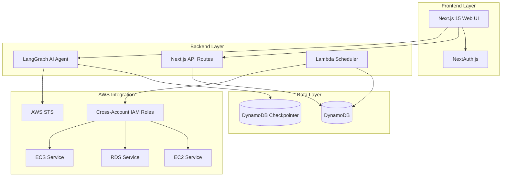
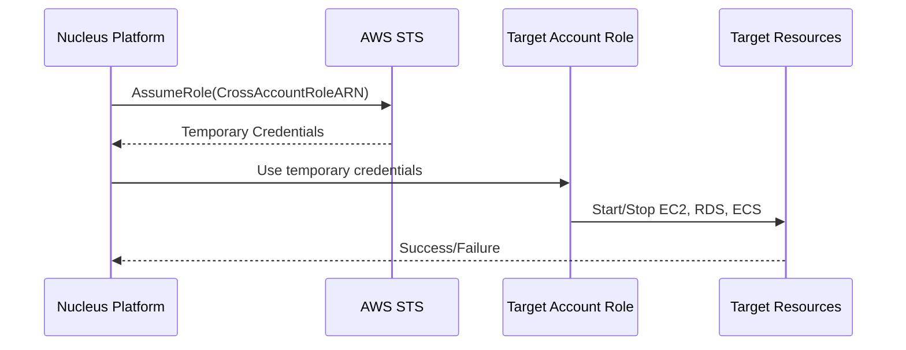
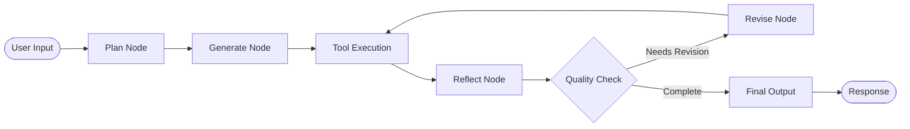
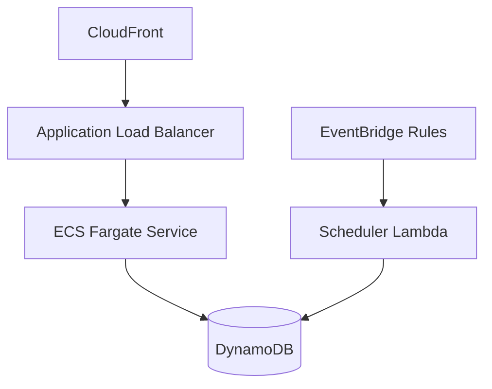

# Nucleus Cloud Ops - Technical Architecture

## Overview

Nucleus Cloud Ops is an enterprise-grade AWS cost optimization and resource scheduling platform that provides centralized control over AWS resources across multiple accounts. The platform automates start/stop operations for EC2, RDS, and ECS services based on user-defined schedules, delivering significant cost savings for non-production environments.

## System Architecture



## Technology Stack

### Frontend
| Technology | Version | Purpose |
|------------|---------|---------|
| Next.js | 15.2.4 | React framework with App Router |
| React | 19 | UI library |
| Tailwind CSS | 3.4.x | Utility-first CSS framework |
| Radix UI | Various | Accessible component primitives |
| Lucide React | 0.454.0 | Icon library |
| Recharts | Latest | Dashboard charts |

### Backend
| Technology | Version | Purpose |
|------------|---------|---------|
| Node.js | 22.x | Runtime environment |
| AWS SDK v3 | 3.x | AWS service integration |
| LangGraph | 0.2.0 | AI agent orchestration |
| LangChain | 0.3.0 | LLM framework |
| AWS Bedrock | - | AI model provider (Claude 4.5 Sonnet) |
| Zod | 3.24.x | Schema validation |

### Infrastructure
| Technology | Purpose |
|------------|---------|
| AWS CDK | Infrastructure as Code |
| AWS Lambda | Serverless scheduler execution |
| AWS DynamoDB | Primary database (Single Table Design) |
| AWS EventBridge | Cron-based schedule triggers |
| AWS Cognito | User authentication |
| AWS ECS/Fargate | Container hosting |

## Data Architecture

### Single Table Design

Nucleus Cloud Ops uses DynamoDB with a Single Table Design for optimal query performance:

```
┌─────────────────────────────────────────────────────────────────┐
│                    Main Application Table                        │
├─────────────────┬───────────────────────────────────────────────┤
│ Entity Type     │ Access Pattern                                │
├─────────────────┼───────────────────────────────────────────────┤
│ TENANT          │ PK: TENANT#{id}, SK: METADATA                 │
│ ACCOUNT         │ PK: TENANT#{tenantId}, SK: ACCOUNT#{id}       │
│ SCHEDULE        │ PK: TENANT#{tenantId}, SK: SCHEDULE#{id}      │
│ RESOURCE        │ PK: SCHEDULE#{scheduleId}, SK: RESOURCE#{id}  │
└─────────────────┴───────────────────────────────────────────────┘

┌─────────────────────────────────────────────────────────────────┐
│                       Audit Table                                │
├─────────────────┬───────────────────────────────────────────────┤
│ Entity Type     │ Access Pattern                                │
├─────────────────┼───────────────────────────────────────────────┤
│ USER_ACTION     │ PK: TENANT#{tenantId}, SK: AUDIT#{timestamp}  │
│ SYSTEM_ACTION   │ PK: SCHEDULE#{scheduleId}, SK: EXEC#{timestamp}│
└─────────────────┴───────────────────────────────────────────────┘
```

### Checkpointing Tables

For AI Agent persistence:
- `DYNAMODB_CHECKPOINT_TABLE`: Stores graph state checkpoints
- `DYNAMODB_WRITES_TABLE`: Stores incremental writes for streaming

## Security Architecture

### Cross-Account Access Model



### IAM Permissions Required

Target accounts must deploy a CloudFormation stack creating an IAM role with:

```yaml
Permissions:
  - ec2:StartInstances
  - ec2:StopInstances
  - ec2:DescribeInstances
  - rds:StartDBInstance
  - rds:StopDBInstance
  - rds:DescribeDBInstances
  - ecs:UpdateService
  - ecs:DescribeServices
  - ecs:ListServices
```

### Trust Relationship

The cross-account role trusts the Nucleus Platform's AWS account:

```json
{
  "Version": "2012-10-17",
  "Statement": [
    {
      "Effect": "Allow",
      "Principal": {
        "AWS": "arn:aws:iam::<NucleusPlatformAccountId>:root"
      },
      "Action": "sts:AssumeRole"
    }
  ]
}
```

## AI Agent Architecture

The DevOps Agent uses a **Reflection Pattern** with LangGraph:



### Agent Nodes

1. **Plan Node**: Creates step-by-step execution plan
2. **Generate Node**: Executes plan using available tools
3. **Tool Node**: Runs tools (AWS CLI, file operations, web search)
4. **Reflect Node**: Evaluates quality and completeness
5. **Revise Node**: Improves output based on reflection
6. **Final Node**: Synthesizes comprehensive response

### Available Tools

| Tool | Description |
|------|-------------|
| `execute_command` | Run shell commands (AWS CLI, etc.) |
| `read_file` | Read file contents |
| `write_file` | Write content to files |
| `list_directory` | List directory contents |
| `web_search` | Search the web via Tavily API |
| `get_aws_credentials` | Obtain AWS credentials for account context |

## Deployment Architecture

### Development Environment

```bash
# Local development
npm run dev  # Starts Next.js on port 3000
```

### Production Deployment



### Infrastructure Stacks

1. **NetworkingStack**: VPC, Subnets, Security Groups
2. **ComputeStack**: ECS Cluster, ALB, CloudFront
3. **WebUIStack**: Next.js application deployment

## Environment Variables

```bash
# AWS Configuration
AWS_REGION=ap-south-1
NEXT_PUBLIC_AWS_REGION=ap-south-1

# DynamoDB Tables
DYNAMODB_TABLE_NAME=nucleus-ops-main
DYNAMODB_AUDIT_TABLE_NAME=nucleus-ops-audit
DYNAMODB_CHECKPOINT_TABLE=nucleus-ops-checkpoints
DYNAMODB_WRITES_TABLE=nucleus-ops-writes

# Authentication
NEXTAUTH_URL=http://localhost:3000
NEXTAUTH_SECRET=<your-secret>

# AI Agent (Optional)
TAVILY_API_KEY=<your-tavily-key>
```

## Performance Considerations

1. **DynamoDB On-Demand**: Auto-scales based on traffic
2. **Lambda Concurrency**: Limited to prevent target API throttling
3. **Batch Processing**: Resources processed in batches to avoid timeouts
4. **Message Truncation**: Agent context window management
5. **Checkpointing**: Persistent conversation state across sessions

## Monitoring & Observability

- **CloudWatch Logs**: All Lambda and ECS logs
- **Audit Trail**: 30-day TTL on audit records
- **Health Endpoint**: `/api/health` for load balancer health checks
