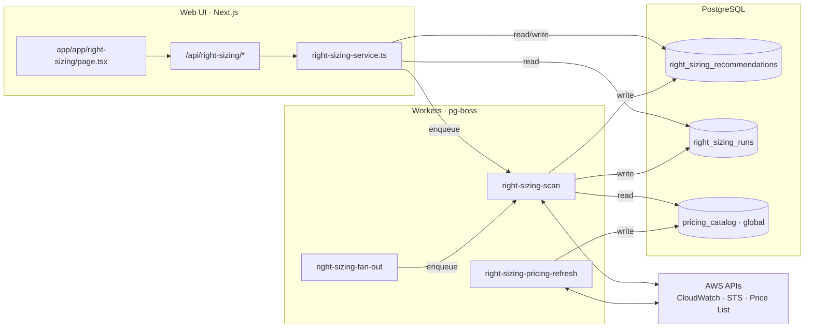
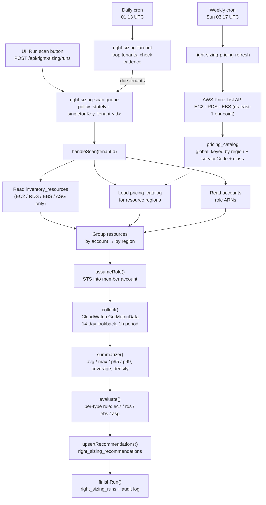

# Right Sizing — Architecture

How a CloudWatch reading becomes a savings recommendation: the full path from a cron
trigger (or a button click) through pg-boss, CloudWatch, and the rule engine, into
Postgres, and back out to the dashboard.

Source: `apps/workers/src/jobs/right-sizing/` (worker jobs) and
`apps/web-ui/app/api/right-sizing/` + `apps/web-ui/components/right-sizing/` (UI).
Gated end-to-end by `RIGHT_SIZING_ENABLED`.

> Verified against a live scan on tenant `smc` (2026-07-07): 28 accounts, 547 resources
> analyzed, 538 recommendations written, ~$3,723/mo in estimated savings found.

## Contents

- [Module map](#module-map)
- [Worker pipeline](#worker-pipeline)
- [Managing multiple / concurrent scans](#managing-multiple--concurrent-scans)
- [Data model](#data-model)
- [UI layer](#ui-layer)
- [Running it locally](#running-it-locally)

## Module map

Three planes, one shared Postgres instance. The web app never talks to AWS directly for
this module — it only ever reads/writes rows and drops a message on a queue.



## Worker pipeline

Two independent jobs feed the same tables. The scan does the analysis; the pricing
refresh just keeps the price list warm so the scan has something to cost against.



Per account × region, in order:

1. **`assumeRole()`** — STS into the member account with that account's stored
   `roleArn` / external ID.
2. **`collect()`** — batched CloudWatch `GetMetricData` calls, 14-day lookback, 1-hour
   period (38 resources → 180 queries, in the run we watched).
3. **`summarize()`** — per resource: avg / max / p95 / p99 / coverage days / datapoint
   density, per metric (CPU, memory, network, disk, IOPS, burst balance, …).
4. **`evaluate()`** — the rule for that resource type (`rules/ec2.ts`, `rds.ts`,
   `ebs.ts`, `asg.ts`) turns the summary + catalog price into a finding: `idle`,
   `over_provisioned`, `under_provisioned`, or `optimized`.

`upsertRecommendations()` writes every finding, keyed on
`(tenantId, accountId, resourceType, resourceId)` — a rerun updates config/cost/savings
but never touches an already-reviewed row's `status`. `finishRun()` closes out
`right_sizing_runs` with counts, total savings, and any per-account/region errors. An
audit event (`right_sizing.run.completed`) is written either way.

`right-sizing-pricing-refresh` runs on its own weekly cron, independent of any tenant's
scan. It reads distinct regions across all active accounts, calls the AWS Price List
API for each, and upserts into the global `pricing_catalog` — the scan just reads
whatever is cached there at scan time.

> **Why this mattered this week:** a fresh environment scans successfully — CloudWatch
> metrics collect fine — but every recommendation shows $0 until the pricing refresh
> has run at least once. It's a five-minute weekly cron that hadn't fired yet; the fix
> was running it, not writing code.

## Managing multiple / concurrent scans

One tenant can never have two scans in flight — cron and a manual click can't collide,
and neither can two impatient clicks on the same button. Different tenants scan fully
independently (the lock below is per-tenant, not global).

```mermaid
sequenceDiagram
    participant U1 as User click #1
    participant U2 as User click #2
    participant Cron as Daily fan-out
    participant Q as right-sizing-scan queue<br/>(singletonKey: tenant:&lt;id&gt;)
    participant W as Worker

    U1->>Q: send(tenantId, trigger=manual)
    Q-->>U1: jobId (202 Accepted)
    Q->>W: job picked up, run starts

    U2->>Q: send(tenantId, trigger=manual)
    Q-->>U2: null (200 alreadyRunning)

    Cron->>Q: send(tenantId, trigger=schedule)
    Q-->>Cron: null (skipped, singleton held)

    W-->>Q: run completes
    Note over Q: singleton released — next request can enqueue
```

pg-boss's `stately` queue policy plus `singletonKey: tenant:<id>` is a Postgres-backed
mutex on the scan queue: whoever asks second — another manual click, the daily fan-out,
a second worker replica — gets `jobId === null` back instead of a new job. The API
surfaces that as `{ alreadyRunning: true }` with HTTP 200 rather than the usual 202,
and the UI shows a toast.

## Data model

Three tables the module owns; three more it only ever reads.

| Table | Scope | Written by | Role |
|---|---|---|---|
| `right_sizing_recommendations` | tenant | scan | One row per resource. Unique on `tenantId+accountId+resourceType+resourceId`; reruns upsert everything except reviewer `status`. |
| `right_sizing_runs` | tenant | scan | One row per run attempt — status, counts, total savings, error list, timestamps. |
| `pricing_catalog` | **global** | pricing-refresh | The one table in this module exempt from `getTenantClient()` — AWS prices aren't tenant data. |
| `inventory_resources` | read-only | discovery job | Source resources the scan analyzes — right-sizing never discovers anything itself. |
| `accounts` | read-only | account onboarding | Role ARN + external ID for STS, plus which regions to price. |
| `tenant_configs` | read-only* | fan-out (writes `lastRunAt`) | Row keyed `configKey='right-sizing-cron'` — cadence + last-run bookkeeping for the daily fan-out only. |

\* the only read-only table the module also writes back to — the fan-out job stamps
`lastRunAt` after a successful enqueue.

## UI layer

`app/app/right-sizing/page.tsx` assembles four pieces: summary cards, a filter bar, the
recommendations table, and a detail dialog. Everything is gated behind the
`RightSizing` RBAC subject, which maps onto the `Inventory` module's permissions —
there's no separate "can trigger a scan" permission; `update` covers both reviewing a
recommendation and running a scan.

| Component | Renders |
|---|---|
| `summary-cards.tsx` | 4 KPI cards — potential monthly savings, over-provisioned / idle / under-provisioned counts, last-scanned timestamp |
| `recommendations-table.tsx` | Sortable table: resource, account/region, finding badge, current → recommended config, savings/mo, confidence, risk, status |
| `recommendation-detail-dialog.tsx` | Modal with CloudWatch metric charts (CPU/memory/throughput/burst) + approve/dismiss/snooze actions |
| `shared.tsx` | Formatters and badges (`FindingBadge`, `RiskBadge`, `StatusBadge`) |

| Route | Method | Does |
|---|---|---|
| `/api/right-sizing/recommendations` | `GET` | list · filter · sort · paginate |
| `/api/right-sizing/recommendations/[id]` | `PATCH` | approve · dismiss · snooze · reopen |
| `/api/right-sizing/summary` | `GET` | KPI aggregates for the summary cards |
| `/api/right-sizing/runs` | `GET` | run history (paginated) |
| `/api/right-sizing/runs` | `POST` | trigger a scan — `202` new, `200 alreadyRunning` |

TanStack Query hooks (`lib/queries/right-sizing.ts`): `useRightSizingRecommendations`,
`useRightSizingSummary`, `useRunRightSizingScan`. None of them poll —
`useRunRightSizingScan`'s `onSuccess` just invalidates the query cache once.

> **Gap worth knowing about:** `GET /api/right-sizing/runs` exists and works, but
> nothing in the UI calls it yet — there's no run-history table and no hook polls run
> status while a scan is in flight. "Run scan" disables itself only for the length of
> its own request; after that, the only way to see whether a scan finished is the
> manual **Refresh** button or checking `right_sizing_runs` directly.

## Running it locally

Both jobs are plain async functions — `job-runner.ts` calls them directly through the
same in-process `VerticalExecutor` the ephemeral ECS containers use, no pg-boss
connection needed.

```bash
# from apps/workers, against a real AWS account
export AWS_PROFILE=STX-CLOUD-PLATFORM

bun run job-runner -- --job right-sizing-pricing-refresh
bun run job-runner -- --job right-sizing-scan \
  --data '{"tenantId":"<tenant-id>","trigger":"manual"}'
```

Reset and re-verify from scratch:

```bash
docker exec -e PGPASSWORD=nucleus_dev nucleus-postgres psql -U nucleus -d nucleus -c \
  'TRUNCATE TABLE right_sizing_recommendations, right_sizing_runs;'

# pricing_catalog is global reference data — only truncate it if you want to force
# a full refetch from AWS; it's not required for a fresh scan.
docker exec -e PGPASSWORD=nucleus_dev nucleus-postgres psql -U nucleus -d nucleus -c \
  'TRUNCATE TABLE pricing_catalog;'
```
