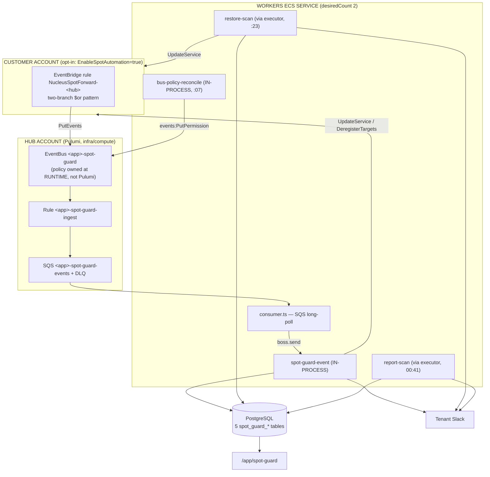

# Fargate Spot Guard — Architecture

Runs ECS services on Fargate Spot safely: falls a service back to On-Demand when Spot
capacity runs out, restores it when capacity returns, pre-drains interrupted tasks from the
load balancer, and reports Spot-vs-On-Demand hours.

Ported from a standalone AWS CDK project (`cdk-ecs-fargate-spot-automation`) that used
EventBridge + SQS + **six Lambdas** + **five DynamoDB tables** across a hub-and-spoke
topology with a hardcoded account list. Nucleus has no Lambda and no DynamoDB, so the
*behaviour* was kept and the *mechanism* rewritten: pg-boss jobs in the `workers` ECS
service, PostgreSQL via Prisma, per-tenant accounts from the `accounts` table.

## Rollout status

**Sandbox only.** The hub infrastructure is gated on a Pulumi config flag,
`nucleus-compute:spotGuardEnabled`, which defaults to `false` and is set `"true"` in
`Pulumi.sbx.yaml` only. `Pulumi.prod.yaml` is untouched; promoting to prod is a one-line
config addition, not a code change.

The worker side is separately gated on `SPOT_GUARD_ENABLED`, so the image ships everywhere
while the behaviour activates only where the infrastructure exists.

## Flow



## Three problems the event-driven choice created

The reference was single-org with 18 known accounts. Nucleus is multi-tenant SaaS, which
made three things load-bearing that the original never had to solve.

### 1. Bus authorization with no shared AWS Organization

Nucleus customers are separate companies, so `aws:PrincipalOrgID` is unavailable. The
reference used `principal: "*"` with **no condition** — any AWS account on earth could
inject events.

Instead: one policy statement whose `aws:PrincipalAccount` condition holds the onboarded
account list, rebuilt from Postgres by `bus-policy.ts`. Sizing decided the shape — one
statement *per account* costs ~225 chars against a 10,240-char limit (**~45 accounts**,
disqualifying), while one statement with a condition list costs ~276 + ~15/account
(**~660**). Asserted in `bus-policy.test.ts`.

The policy is **deliberately not declared in Pulumi**: the allowlist changes at runtime, and
a Pulumi-managed `EventBusPolicy` would revert every runtime change on the next `pulumi up`,
silently cutting off every customer added since the last deploy.

What the allowlist actually buys: `event.account` is stamped by EventBridge and is **not**
settable via `PutEvents` (the API has no `Account` field), and EventBridge blocks multi-hop
relay — so an unauthorized sender can only inject events attributed to *itself*, which the
consumer drops. The allowlist is therefore a **cost/DoS control**; integrity comes from the
consumer's ARN/account cross-check and per-tenant assumed roles.

### 2. `accountId` → `tenantId` is ambiguous

`accounts` is unique on `[tenantId, accountId]`, so the same AWS account can be registered
by more than one tenant. Observability rows are written **per tenant** — both paid for that
account. But `ecs:UpdateService` acts on one AWS resource, so the mutation fires **once**,
via four layers:

1. Deterministic acting-tenant election (`tenantId ASC`, row 0) — no coordination needed.
2. Atomic minute-window claim in `spot_guard_actions` (deliberately **not** tenant-scoped).
3. The engine's live-AWS-state idempotency guard — **strongest**, because it derives from
   what AWS reports rather than our bookkeeping, so it holds even if 1 and 2 both fail.
4. Write ordering: the restore baseline is persisted *before* `UpdateService`, and only when
   active Spot exists, so a partial failure can never poison it.

### 3. One ECS RunTask per event would be unusable

In prod `WORKER_ARCH=horizontal`, so `executor.execute()` launches an ephemeral Fargate task
per job (~30–90s, ~$0.0013). One busy 20-service cluster emits ~4,800 task-state events/day
→ **~$6.30/day/account, ~$9.5k/month at 50 accounts** — and it would miss the ~2-minute Spot
notice window every time.

So `spot-guard-event` and `spot-guard-bus-policy-reconcile` run **in-process**, while the
per-tenant `restore-scan`/`report-scan` use the executor. The dividing line is *bounded,
sub-second, latency-critical, high-volume* vs *unbounded fan-out over a tenant's estate*.

**Enforced by omission**: the two in-process jobs are deliberately absent from
`job-runner.ts` `HANDLERS`. If someone routes them through the executor, the ephemeral task
fails loudly on an unknown job name rather than quietly costing thousands a month.

## Module map

| Layer | Path |
|---|---|
| Decision engine (pure) | `apps/workers/src/jobs/spot-guard/services/engine.ts` |
| Alert dedup | `.../services/dedup.ts` |
| DB writers | `.../services/db-writer.ts` |
| Account resolution + ARN check | `.../services/account-resolver.ts` |
| ECS/ALB mutations | `.../services/ecs-client.ts` |
| Notifier (event + Slack) | `.../services/notifier.ts` |
| Event handler | `.../handlers/handle-spot-event.ts` |
| Hourly restore | `.../handlers/handle-restore-scan.ts` |
| Daily report | `.../handlers/handle-report-scan.ts` + `.../report/` |
| SQS bridge | `.../consumer.ts` |
| Bus policy | `.../bus-policy.ts` |
| Registration | `.../index.ts` |
| Hub infra (sbx-gated) | `infra/compute/index.ts` |
| Customer template | `apps/web-ui/lib/cf-template-generator.ts` |
| Repository | `apps/web-ui/lib/db/repositories/spot-guard/` |
| Service layer | `apps/web-ui/lib/spot-guard-service.ts` |
| API | `apps/web-ui/app/api/spot-guard/**` |
| UI | `apps/web-ui/app/app/spot-guard/`, `components/spot-guard/` |

## Schedules

Staggered off `:00` **and** off every multiple of 5 (the scheduler fan-out is `*/5`):

| Job | Cron (UTC) | Retries |
|---|---|---|
| `spot-guard-bus-policy-reconcile` | `7 * * * *` | 3 — idempotent |
| `spot-guard-restore-fan-out` | `23 * * * *` | **0** — mutates live compute |
| `spot-guard-report-fan-out` | `41 0 * * *` | 2 — read-only |

`restore-scan` uses `retryLimit: 0` because every restore is an `UpdateService` with
`forceNewDeployment`; a retry would bounce production tasks twice. The next hourly tick *is*
the retry. Same choice as `scheduler-scan`, deliberately unlike `right-sizing-scan`.

## Alert taxonomy

Dedup windows ported verbatim. **Dedup gates Slack only, never the database** — the event row
is the product surface, and suppressing rows would punch holes in the timeline during exactly
the incident an operator is looking at. Rows record `notifiedSlack` and
`suppressedBySlackDedup`.

| Alert | Window |
|---|---|
| `interruption`, `placement_failure`, `remediation` | 300s |
| `fallback`, `recovery` | 600s |
| `restore_attempt` | 3600s |
| `restore_failed` | 900s — **new**; the reference never alerted on this |
| `spot_enabled`, `spot_disabled` | 0 (never deduped) |

## Reference-implementation bugs fixed

Deliberately not reproduced. Each has a named regression test.

1. **`region` never persisted** → the reference was silently single-region, and same-named
   clusters in different regions collapsed onto one row. `region` is now in the unique key.
2. **`duration_seconds` stored as a string** → `DOUBLE PRECISION`.
3. **Midnight-spanning tasks filed on the wrong day** → fixed *structurally* by time-weighted
   interval clipping. A 22:00→02:00 task contributes 2h to each day. (Switching `createdAt` →
   `stoppedAt`, the obvious fix, just moves all 4h to the other wrong day.)
4. **Unpaginated report query truncated at 1 MB** → server-side `GROUP BY` makes truncation
   structurally impossible.
5. **Open sessions had no TTL** → 14-day orphan reaper, extended to 90 days on close.
6. **Strategy hardening never persisted** → the reference recomputed the same fix from stale
   input every hour forever.
7. **Restore thrashing** → the backoff was stamped only when `UpdateService` itself threw,
   never when the *asynchronous* placement failure arrived. Now both paths arm it.
8. Dead code and over-broad IAM (including `sts:AssumeRole` on `Resource: "*"`).
9. **Dedup keys collided across cluster and region** → two clusters each running an `api`
   service in one account shared one throttle window and silently suppressed each other.
10. **DynamoDB TTL was never a valid dedup window** — it deletes lazily up to 48h late, so
    the "300 second" windows were really "at least 300s, possibly two days".
11. **Fallback destroyed On-Demand `base` guarantees** — hardcoded `base: 0` on both
    branches, and the reverter only restored `weight`.
12. `source: "test.aws.ecs"` was a synthetic-event injection surface. Dropped.
13. Invalid Slack colours (`"#warning"`, `"#good"` are neither keywords nor hex, so they were
    silently ignored for the feature's whole life).

Also **not** carried forward: a live Slack webhook committed in plaintext in four files. It
should be rotated in the old repo independently.

## Bugs found in Nucleus while porting

- **`TIMESTAMP(3)` vs instants.** Prisma's `DateTime` maps to `timestamp(3)` *without* a
  zone, and node-postgres serializes a JS `Date` with the client's local offset — which a
  zone-less column discards. Durations were therefore correct on ECS (`TZ=UTC`) and wrong
  anywhere else. All 27 Spot Guard timestamp columns are `TIMESTAMPTZ(3)`. **The rest of the
  schema has the same latent issue** and deserves its own fix.
- **`prisma migrate dev` emits destructive drift correction.** The autogenerated diff for
  this feature wanted to `DROP INDEX` the pgvector HNSW index, the inventory tsvector index
  and the KB embedding index, plus `DROP COLUMN inventory_resources.contentHash`. Those
  indexes are created by raw SQL and cannot be expressed in `schema.prisma`, so Prisma reads
  them as extraneous. **Hand-write migrations for this schema.**
- **`ecs_services` metadata `clusterArn` is absent on every row.** `pg-writer.ts` maps
  `'ClusterArn'` (capital C) but ECS returns `clusterArn`. The existing test passes because
  its fixture uses the capital-C key — the test encodes the wrong AWS shape. Worked around
  with a correctly-cased `ecsClusterArn`; the original mapping is left alone because fixing
  it would make a value appear where consumers currently see `undefined`.

## Verification

```bash
docker compose up -d postgres
cd apps/workers  && bun run test -- src/jobs/spot-guard   # 243 tests
cd apps/workers  && bun run typecheck
cd apps/web-ui   && bun run test -- lib/spot-guard lib/db/repositories/spot-guard \
                     lib/cf-template-generator.test.ts tests/tenant-isolation/spot-guard.test.ts \
                     app/api/spot-guard                    # 132 tests
cd apps/web-ui-e2e && npx playwright test spot-guard.spec.ts --project=chromium

# Infra — prod MUST report no changes
cd infra/compute
PULUMI_CONFIG_PASSPHRASE="" pulumi preview --stack prod
PULUMI_CONFIG_PASSPHRASE="" pulumi preview --stack sbx
```

**Before shipping the customer template**, validate the two-branch `$or` pattern with the
EventBridge Sandbox / `TestEventPattern` against a real captured `ECS Task State Change`
*and* `ECS Service Action` payload. It is the one construct that could not be verified from
documentation alone, and getting it wrong silently disables placement-failure handling.

**Kill switch:** setting `spotAutomationEnabled = false` on all accounts makes the reconciler
`RemovePermission`, stopping all inbound events within ~30s with no infrastructure change.
