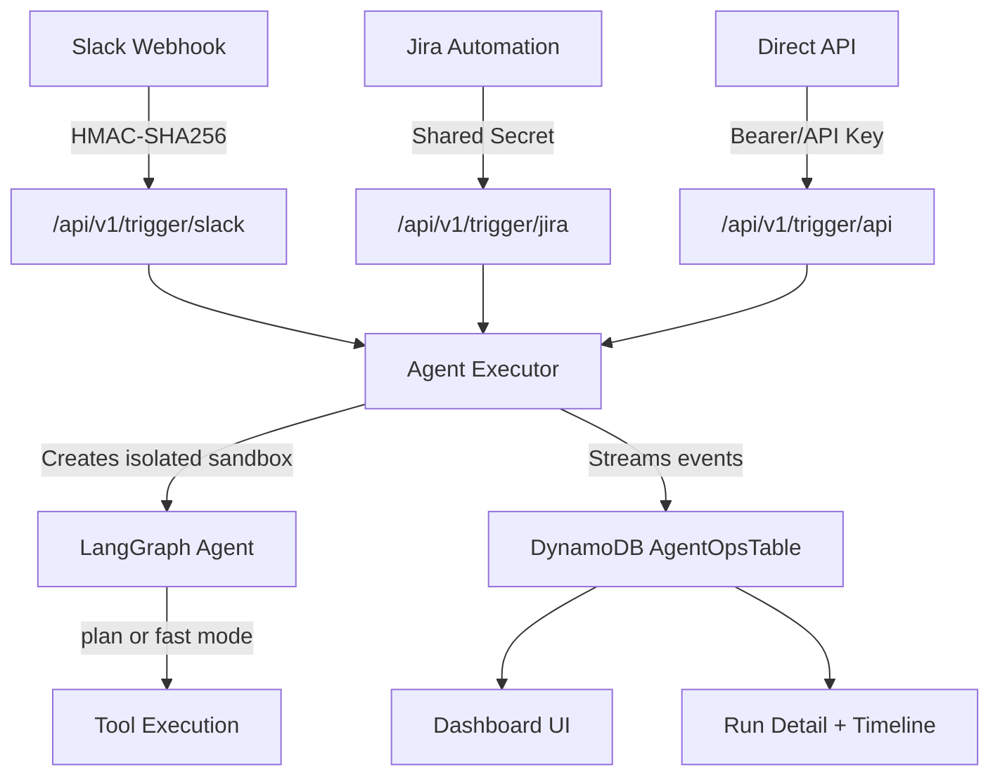

# Agent Ops — Implementation Walkthrough

## Overview

Implemented the Agent Ops feature: headless, event-driven agent executions triggered by external systems (Slack, Jira, or direct API). Each run creates an isolated agent with full execution event recording to DynamoDB.

## Files Created/Modified

### Data Layer (6 files)

| File | Purpose |
|------|---------|
| [types.ts](file:///Users/kartik/Documents/git-repo/nucleus-cloud-ops/web-ui/lib/agent-ops/types.ts) | Core type definitions (enums, interfaces, API contracts) |
| [dynamoose-config.ts](file:///Users/kartik/Documents/git-repo/nucleus-cloud-ops/web-ui/lib/agent-ops/dynamoose-config.ts) | Dynamoose initialization with AWS region |
| [agent-ops-run.ts](file:///Users/kartik/Documents/git-repo/nucleus-cloud-ops/web-ui/lib/agent-ops/models/agent-ops-run.ts) | Dynamoose model for run records (single-table + GSI1) |
| [agent-ops-event.ts](file:///Users/kartik/Documents/git-repo/nucleus-cloud-ops/web-ui/lib/agent-ops/models/agent-ops-event.ts) | Dynamoose model for execution events |
| [agent-ops-service.ts](file:///Users/kartik/Documents/git-repo/nucleus-cloud-ops/web-ui/lib/agent-ops/agent-ops-service.ts) | CRUD service wrapping models |
| [agent-executor.ts](file:///Users/kartik/Documents/git-repo/nucleus-cloud-ops/web-ui/lib/agent-ops/agent-executor.ts) | Isolated agent execution bridge with event streaming |

---

### Trigger Endpoints (5 files)

| File | Purpose |
|------|---------|
| [slack-validator.ts](file:///Users/kartik/Documents/git-repo/nucleus-cloud-ops/web-ui/lib/agent-ops/slack-validator.ts) | HMAC-SHA256 verification + slash command parsing |
| [jira-validator.ts](file:///Users/kartik/Documents/git-repo/nucleus-cloud-ops/web-ui/lib/agent-ops/jira-validator.ts) | Shared-secret verification + task extraction |
| [slack/route.ts](file:///Users/kartik/Documents/git-repo/nucleus-cloud-ops/web-ui/app/api/v1/trigger/slack/route.ts) | `POST /api/v1/trigger/slack` — fire-and-forget + response_url callback |
| [jira/route.ts](file:///Users/kartik/Documents/git-repo/nucleus-cloud-ops/web-ui/app/api/v1/trigger/jira/route.ts) | `POST /api/v1/trigger/jira` — async execution for automation rules |
| [api/route.ts](file:///Users/kartik/Documents/git-repo/nucleus-cloud-ops/web-ui/app/api/v1/trigger/api/route.ts) | `POST /api/v1/trigger/api` — direct programmatic trigger |

---

### Web UI (4 files)

| File | Purpose |
|------|---------|
| [/api/agent-ops/route.ts](file:///Users/kartik/Documents/git-repo/nucleus-cloud-ops/web-ui/app/api/agent-ops/route.ts) | List runs API (pagination, filtering) |
| [/api/agent-ops/[runId]/route.ts](file:///Users/kartik/Documents/git-repo/nucleus-cloud-ops/web-ui/app/api/agent-ops/%5BrunId%5D/route.ts) | Run detail API (run + events) |
| [/agent-ops/page.tsx](file:///Users/kartik/Documents/git-repo/nucleus-cloud-ops/web-ui/app/agent-ops/page.tsx) | Dashboard with stats cards, filters, auto-refresh |
| [/agent-ops/[runId]/page.tsx](file:///Users/kartik/Documents/git-repo/nucleus-cloud-ops/web-ui/app/agent-ops/%5BrunId%5D/page.tsx) | Run detail with execution timeline |

---

### Infrastructure (2 files modified)

| File | Changes |
|------|---------|
| [computeStack.ts](file:///Users/kartik/Documents/git-repo/nucleus-cloud-ops/lib/computeStack.ts) | Added `AgentOpsTable` DynamoDB (PK/SK + GSI1), IAM perms, env var |
| [.env.example](file:///Users/kartik/Documents/git-repo/nucleus-cloud-ops/.env.example) | Added `AGENT_OPS_TABLE_NAME`, `AGENT_OPS_ENABLED`, secrets |
| [sidebar.tsx](file:///Users/kartik/Documents/git-repo/nucleus-cloud-ops/web-ui/components/sidebar.tsx) | Added "Agent Ops" nav item with Zap icon |

## Architecture

## Verification

- **TypeScript compilation**: Zero agent-ops related errors
- **CDK synthesis**: Infrastructure ready for deployment
- **Remaining**: Manual testing with `npm run dev` and CDK deploy
