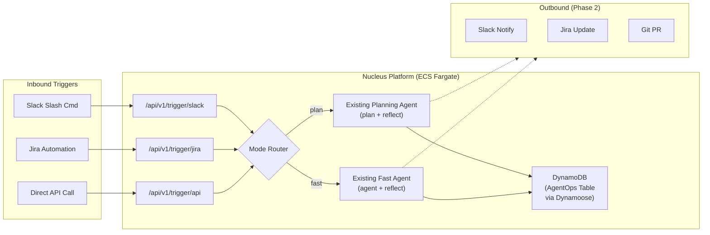

# Agent Ops — Implementation Plan (v2)

## Overview

**Agent Ops** extends Nucleus Cloud Ops with **background agents** — headless, event-driven executions triggered by external systems (Slack, Jira, direct API). Each execution spins up in an **isolated environment** with its own sandbox directory, thread ID, and credentials context, ensuring **full concurrency safety** when multiple agents run in parallel. Inbound requests hit dedicated REST endpoints, which directly invoke the **existing LangGraph agent** (plan+reflect or fast mode) and store run metadata + all execution events in a new DynamoDB table via **Dynamoose ODM**.



---

## Proposed Changes

### Component 1: Dynamoose ODM & Data Layer

New DynamoDB table with Dynamoose ODM for agent-ops run tracking. Follows single-table design with multi-tenancy.

#### [NEW] [dynamoose-config.ts](file:///Users/kartik/Documents/git-repo/nucleus-cloud-ops/web-ui/lib/agent-ops/dynamoose-config.ts)

- Initialize Dynamoose with AWS region configuration
- Connection setup reusable across models

#### [NEW] [models/agent-ops-run.ts](file:///Users/kartik/Documents/git-repo/nucleus-cloud-ops/web-ui/lib/agent-ops/models/agent-ops-run.ts)

- **Run record** — Dynamoose model with single-table design:

| Attribute | Type | Description |
|-----------|------|-------------|
| `PK` | String (Hash) | `TENANT#<tenantId>` |
| `SK` | String (Range) | `RUN#<runId>` |
| `GSI1PK` | String | `SOURCE#<source>` |
| `GSI1SK` | String | `<timestamp>#<runId>` |
| `runId` | String | UUID |
| `source` | String | `slack` / `jira` / `api` |
| `status` | String | `queued` → `in_progress` → `completed` / `failed` |
| `taskDescription` | String | Natural language request |
| `mode` | String | [plan](file:///Users/kartik/Documents/git-repo/nucleus-cloud-ops/web-ui/lib/agent/planning-agent.ts#115-194) or `fast` |
| `accountId` | String | Target AWS account |
| `selectedSkill` | String | Agent skill |
| `threadId` | String | LangGraph thread ID |
| `trigger` | Map | Source-specific metadata (userId, channelId, issueKey) |
| `result` | Map | Execution summary |
| `error` | String | Error message if failed |
| `createdAt` | String | ISO timestamp |
| `updatedAt` | String | ISO timestamp |
| `ttl` | Number | 30-day TTL epoch |

#### [NEW] [models/agent-ops-event.ts](file:///Users/kartik/Documents/git-repo/nucleus-cloud-ops/web-ui/lib/agent-ops/models/agent-ops-event.ts)

- **Execution events** — captures every agent step for future UI rendering:

| Attribute | Type | Description |
|-----------|------|-------------|
| `PK` | String (Hash) | `RUN#<runId>` |
| `SK` | String (Range) | `EVENT#<timestamp>#<sequence>` |
| `eventType` | String | `planning` / `execution` / `tool_call` / `tool_result` / `reflection` / `revision` / [final](file:///Users/kartik/Documents/git-repo/nucleus-cloud-ops/web-ui/lib/agent/planning-agent.ts#473-530) / `error` |
| `node` | String | LangGraph node name |
| `content` | String | LLM response text or tool output |
| `toolName` | String | Tool name (for tool_call/tool_result events) |
| `toolArgs` | Map | Tool arguments |
| `toolOutput` | String | Tool execution result |
| `metadata` | Map | Additional context (iteration, model, tokens) |
| `createdAt` | String | ISO timestamp |
| `ttl` | Number | 30-day TTL epoch |

#### [NEW] [agent-ops-service.ts](file:///Users/kartik/Documents/git-repo/nucleus-cloud-ops/web-ui/lib/agent-ops/agent-ops-service.ts)

- CRUD service wrapping both Dynamoose models
- Run methods: `createRun()`, `updateRunStatus()`, `getRun()`, `listRuns()`, `listRunsBySource()`
- Event methods: `recordEvent()`, `getRunEvents()` — stores each planning step, tool call, tool result, and reflection

#### [NEW] [types.ts](file:///Users/kartik/Documents/git-repo/nucleus-cloud-ops/web-ui/lib/agent-ops/types.ts)

- `AgentOpsRun`, `AgentOpsStatus`, `TriggerSource`, `TriggerMetadata` types

---

### Component 2: CDK Infrastructure

#### [MODIFY] [computeStack.ts](file:///Users/kartik/Documents/git-repo/nucleus-cloud-ops/lib/computeStack.ts)

- Add new DynamoDB table `AgentOpsTable` with:
  - PK/SK keys for single-table design
  - GSI1 (GSI1PK/GSI1SK) for querying by source
  - TTL attribute enabled
  - PAY_PER_REQUEST billing
- Pass table name as env var to ECS task definition

#### [MODIFY] [.env.example](file:///Users/kartik/Documents/git-repo/nucleus-cloud-ops/.env.example)

- Add `AGENT_OPS_TABLE_NAME`, `AGENT_OPS_ENABLED`, `SLACK_SIGNING_SECRET`, `JIRA_WEBHOOK_SECRET`

---

### Component 3: Inbound Trigger Endpoints (Separate Routes)

Three dedicated endpoints — clean separation, no if/else routing.

#### [NEW] [/api/v1/trigger/slack/route.ts](file:///Users/kartik/Documents/git-repo/nucleus-cloud-ops/web-ui/app/api/v1/trigger/slack/route.ts)

- Validates Slack request signature using `SLACK_SIGNING_SECRET`
- Parses slash command payload (`/cloud-ops <task>`)
- Extracts: `taskDescription`, `userId`, `channelId`, `responseUrl`
- Creates run record via `agent-ops-service`
- Invokes existing LangGraph agent directly (routes to [plan](file:///Users/kartik/Documents/git-repo/nucleus-cloud-ops/web-ui/lib/agent/planning-agent.ts#115-194) or `fast` based on query)
- Returns `200 OK` with `{ runId }` within Slack's 3-second requirement
- Agent runs async; results posted back via `responseUrl`

#### [NEW] [/api/v1/trigger/jira/route.ts](file:///Users/kartik/Documents/git-repo/nucleus-cloud-ops/web-ui/app/api/v1/trigger/jira/route.ts)

- Validates Jira webhook secret
- Parses Jira automation rule payload
- Extracts: `taskDescription`, `issueKey`, `projectKey`, `reporter`
- Creates run record, invokes agent, returns `{ runId }`

#### [NEW] [/api/v1/trigger/api/route.ts](file:///Users/kartik/Documents/git-repo/nucleus-cloud-ops/web-ui/app/api/v1/trigger/api/route.ts)

- Vanilla API trigger with direct JSON payload
- Accepts `taskDescription`, `accountId`, `selectedSkill`, `mode`, `callbackUrl`
- API key or bearer token auth
- Creates run record, invokes agent, returns `{ runId }`

#### [NEW] [slack-validator.ts](file:///Users/kartik/Documents/git-repo/nucleus-cloud-ops/web-ui/lib/agent-ops/slack-validator.ts)

- Slack HMAC-SHA256 signature verification

#### [NEW] [jira-validator.ts](file:///Users/kartik/Documents/git-repo/nucleus-cloud-ops/web-ui/lib/agent-ops/jira-validator.ts)

- Jira webhook secret validation

---

### Component 4: Agent Execution Bridge

Bridges the trigger endpoints with the existing LangGraph agent.

#### [NEW] [agent-executor.ts](file:///Users/kartik/Documents/git-repo/nucleus-cloud-ops/web-ui/lib/agent-ops/agent-executor.ts)

- Reuses [createReflectionGraph()](file:///Users/kartik/Documents/git-repo/nucleus-cloud-ops/web-ui/lib/agent/planning-agent.ts#31-627) and [createFastGraph()](file:///Users/kartik/Documents/git-repo/nucleus-cloud-ops/web-ui/lib/agent/fast-agent.ts#30-302) from existing [graph-factory.ts](file:///Users/kartik/Documents/git-repo/nucleus-cloud-ops/web-ui/lib/agent/graph-factory.ts)
- Smart routing: analyzes task description to pick [plan](file:///Users/kartik/Documents/git-repo/nucleus-cloud-ops/web-ui/lib/agent/planning-agent.ts#115-194) (complex infra) or `fast` (simple queries)

**Concurrency & Isolation** — each execution gets:
- Unique `threadId` (UUID) for LangGraph state isolation
- Isolated sandbox directory (`/tmp/agent-ops/<runId>/`) for file operations
- Independent AWS credentials context per run
- No shared mutable state between concurrent runs

**Execution event recording** — uses `graph.streamEvents()` to capture every agent step:
- Planning output, execution output, tool calls + results, reflections, revisions, final summary
- Each event is persisted to DynamoDB via `agent-ops-service.recordEvent()`
- This enables future UI rendering of the full execution timeline

**Execution flow:**
1. Create isolated sandbox dir
2. Update run status → `in_progress`
3. Build [GraphConfig](file:///Users/kartik/Documents/git-repo/nucleus-cloud-ops/web-ui/lib/agent/agent-shared.ts#208-217) from trigger payload
4. Invoke graph with `graph.streamEvents()` — process events async
5. Record each event to DynamoDB
6. Capture final result from agent output
7. Update run status → `completed` / `failed`
8. Cleanup sandbox dir
- Error handling with status tracking and full error capture

---

### Component 5: Web UI — Agent Ops Dashboard

#### [NEW] [/app/agent-ops/page.tsx](file:///Users/kartik/Documents/git-repo/nucleus-cloud-ops/web-ui/app/agent-ops/page.tsx)

- Dashboard listing triggered runs with:
  - Source icon (Slack/Jira/API), Task Description, Status badge
  - Timestamp, Duration
  - Click to expand detail

#### [NEW] [/app/agent-ops/layout.tsx](file:///Users/kartik/Documents/git-repo/nucleus-cloud-ops/web-ui/app/agent-ops/layout.tsx)

- Layout wrapper

#### [NEW] [/app/agent-ops/[runId]/page.tsx](file:///Users/kartik/Documents/git-repo/nucleus-cloud-ops/web-ui/app/agent-ops/[runId]/page.tsx)

- Run detail: task, source, agent execution log, result, errors

#### [MODIFY] [sidebar.tsx](file:///Users/kartik/Documents/git-repo/nucleus-cloud-ops/web-ui/components/sidebar.tsx)

- Add "Agent Ops" nav item with `Zap` icon after "AI Ops"

#### [NEW] [/api/agent-ops/route.ts](file:///Users/kartik/Documents/git-repo/nucleus-cloud-ops/web-ui/app/api/agent-ops/route.ts)

- GET: List runs (paginated, filterable by source/status)

#### [NEW] [/api/agent-ops/[runId]/route.ts](file:///Users/kartik/Documents/git-repo/nucleus-cloud-ops/web-ui/app/api/agent-ops/[runId]/route.ts)

- GET: Single run detail

---

## Deferred to Phase 2

| Feature | Reason |
|---------|--------|
| `generate_tf` tool | Needs scoping for Terraform generation approach |
| `git_pr` tool | PR/code gen node to be added later |
| SQS queue | Eliminated for simplicity; can be added if scale demands it |
| Slack interactive approval buttons | Human gate exists in the core graph; Slack UX deferred |

---

## Verification Plan

### Automated Tests
- `web-ui/tests/agent-ops/slack-trigger.test.ts` — Signature validation, payload parsing
- `web-ui/tests/agent-ops/jira-trigger.test.ts` — Secret validation, payload parsing
- `web-ui/tests/agent-ops/agent-ops-service.test.ts` — Dynamoose CRUD operations

### Manual Verification
```bash
# Direct API trigger test
curl -X POST http://localhost:3000/api/v1/trigger/api \
  -H "Content-Type: application/json" \
  -H "Authorization: Bearer <token>" \
  -d '{
    "taskDescription": "Check Lambda configs in account STX-EKYC-NON-PROD",
    "accountId": "123456789",
    "selectedSkill": "debugging",
    "mode": "fast"
  }'
```
- CDK: `cdk diff` to verify new DynamoDB table
- UI: Navigate to Agent Ops dashboard, verify runs appear
